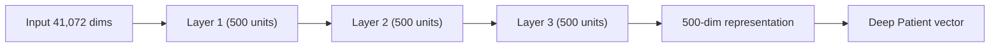

# Deep Patient
## Unsupervised Representation Learning from Electronic Health Records

 

**Miotto, Li, Kidd & Dudley (2016)**  
*Scientific Reports*

 

**Anton Rasmussen**  
CS781 — AI for Health Sciences  
Spring 2026

<!--
Hi everyone. I'm presenting "Deep Patient" by Miotto, Li, Kidd, and Dudley, published in Scientific Reports in 2016.

The main idea is unsupervised deep feature learning on raw, aggregated electronic health record data. The authors run that data through a stack of denoising autoencoders without using disease labels in that phase, and they get a dense five-hundred-dimensional vector for each patient. Then they attach supervised models downstream — in this paper, one random forest per disease — to predict which of seventy-eight future disease categories a patient will newly receive.

I'm going to walk through how they built the data, the model and the math at a high level, the full results tables as printed in the paper, and what the authors say limits the work. When I get to material that isn't in the paper itself, I'll say so explicitly — especially on the slide comparing twenty-sixteen to twenty-twenty-six architectures and on the responsible-deployment critique.

Next I'll give you the formal citation and a one-sentence summary.
-->

---

## 📖 Paper Overview

**Miotto, R., Li, L., Kidd, B. A., & Dudley, J. T. (2016).**  
*Deep Patient: An Unsupervised Representation to Predict the Future of Patients from the Electronic Health Records.*  
Scientific Reports, 6, 26094.  
[DOI: 10.1038/srep26094](https://doi.org/10.1038/srep26094)

 

**One-sentence summary:** Unsupervised deep feature learning produces a general-purpose patient representation that outperforms standard baselines for broad disease prediction.

 

**Scale:** Mount Sinai Health System — 704,587 patients for representation learning, 76,214 test patients, 78 diseases, mean AUC (area under the ROC [receiver operating characteristic] curve) 0.773.

<!--
The authors argue that reusing electronic health records for research and decision support is promising, but summarizing and representing patient data is genuinely difficult. That's one reason predictive models from EHRs haven't been widely reliable in real clinical workflows; they cite work by Bellazzi and Zupan, Jensen and colleagues, and others on that point.

Their approach is to learn a general-purpose patient representation without supervision on the prediction task, then evaluate it by predicting future diagnoses.

Here are the headline numbers straight from the paper: seven hundred four thousand five hundred eighty-seven patients for feature learning; seventy-six thousand two hundred fourteen in the test set for the supervised evaluation; seventy-eight disease categories after clinician filtering; and a mean area under the ROC curve of zero point seven seven three for DeepPatient versus zero point six five nine for raw features. They describe that as roughly a fifteen percent relative improvement in mean AUC.

I want to be clear: the representation-learning phase is unsupervised. The random forest classifiers are supervised and are trained on two hundred thousand patients.

[Q&A ONLY] If someone asks why this lives in Scientific Reports rather than a clinical trial journal — it's a methods and large-scale empirical study. The novelty is the representation pipeline and the breadth of the evaluation, not a randomized trial.

I'll show you how I'm organizing the rest of the talk on the next slide.
-->

---

## 🎯 Objectives

 

1. **Motivation & prior work** — Why EHR prediction is hard; supervised vs unsupervised representation learning
2. **Data pipeline** — How Electronic Health Record (EHR) data becomes a high-dimensional feature matrix
3. **Model architecture** — Denoising autoencoders (math + stacked SDA) and the 500-dim embedding
4. **Evaluation results** — Aggregate performance, full Table 2, full Table 3 + R-precision
5. **Discussion** — Psychiatric signal, applications, authors' limitations, modern context & responsible deployment
6. **Course connection** — All of Us (AoU) and course project bridge

<!--
Here's how I'm structuring the rest of the talk, matching the list on this slide.

First, motivation and prior work — why EHR prediction is hard and why the authors bet on unsupervised deep learning.

Second, three data slides: what Mount Sinai data looks like, how they engineered about forty-one thousand descriptors including LDA topics from notes, and the temporal train-test split with cohort sizes.

Third, the model: intuition for denoising autoencoders, the equations from the paper, the three-layer stacked denoising autoencoder with five percent masking noise and five hundred hidden units per layer, and the random forest heads.

Fourth, results: Table one aggregates, the full Table two, and the full Table three plus the R-precision story.

Fifth, discussion: why psychiatric phenotypes are interesting, the applications the authors themselves discuss, their stated limitations, then my editorial comparison of twenty-sixteen versus twenty-twenty-six architectures and a short responsible-deployment critique. Schwartz and Obermeyer are only on the references slide for that editorial part.

Sixth, a brief bridge to my own course direction — All of Us and the course project — and I'll skip or shorten that if I'm running low on time.

For every number and pipeline claim, I'm citing Miotto and colleagues, twenty-sixteen. The supplementary references are only for the slides where I say I'm going outside the paper.

Now I'll start with motivation and prior work.
-->

---
class: compact-slide
---

## 🧭 Motivation & Prior Work

**Why EHRs are hard to model** (paper, Introduction):

- **High dimensionality, noise, heterogeneity, sparseness, incompleteness** — plus random errors and systematic biases
- **Same clinical phenotype, many encodings** — e.g. type 2 diabetes: HbA1c (glycated hemoglobin) threshold, ICD-9 code 250.00, or language in notes

**How people usually built features**

- **Supervised / expert-driven:** Domain expert picks variables and task — appropriate sometimes, but **scales poorly**, **generalizes weakly**, and **misses novel patterns**
- **Shallow data-driven methods** (cited prior work): still often represent each patient as a **very wide, sparse descriptor vector** — noisy and weak for **hierarchical latent structure**

**This paper's move**

- **Unsupervised deep feature learning** on aggregated EHRs → compact **"deep patient"** vector, **not tuned to one disease**
- **Claim at publication:** deep feature learning was used broadly for text and multimedia, but **not yet** for a **general-purpose patient representation** from large-scale EHR aggregation (they contrast with small or task-specific deep uses in clinical settings)

<!--
Everything on this slide comes from the paper's introduction and the start of the Methods section; I'm not adding references they don't cite.

The authors lean on the representation-learning framing from Bengio, Courville, and Vincent, twenty-thirteen, and the Jordan and Mitchell piece in Science — the point is that features matter as much as the classifier you bolt on top.

The diabetes example is theirs: the same clinical phenotype can show up as a hemoglobin A-one-C threshold, an ICD-nine code, or language in a note. That multiplicity is part of why a giant sparse descriptor matrix is noisy and hard for shallow methods.

A lot of prior work built predictors for one disease or one domain. This paper evaluates on seventy-eight diseases to argue the representation isn't specialized to a single task.

[Q&A ONLY] If someone asks what was novel in twenty-sixteen: stacked denoising autoencoders at this scale on multimodal EHR — structured data plus note topics — with evaluation on future diagnoses and a calendar split. That's a different setting from a single-disease model.

They also contrast their work with a small Chinese EMR study that used deep belief networks for acupuncture recommendations with supervised feature optimization — a different goal and scale.

Next I'll walk through the Mount Sinai data: how big the cohort is, what modalities they used, and what actually goes into the matrix.
-->

---

## 📊 Data: The EHR Challenge

**Mount Sinai** — ~1.2M patients, ICD-9 (International Classification of Diseases, 9th revision) (1980–2014)

| Type | Examples | Notes |
|------|----------|-------|
| **Structured** | Demographics, ICD-9, meds, procedures | Electronic records fully implemented 2003; earlier visits migrated, may be incomplete |
| **Semi-structured** | Lab tests | Freq. counts only; no result values |
| **Unstructured** | Clinical notes | Natural Language Processing (NLP) pipeline → LDA topics |

**Output:** ~41,000 features/patient, ~1% density

<!--
I'll walk through this table row by row.

First, the setting: this is Mount Sinai Health System data, with about one point two million patients who have at least one ICD-nine diagnosis between nineteen eighty and twenty-fourteen.

Start with the structured row. That means demographics, ICD-nine codes, medications, and procedures — the conventional coded parts of the record.

Then the semi-structured row: lab tests. In this paper they do not use lab values themselves; they use how often each normalized lab test appears.

Then the unstructured row: clinical notes. Those do not go straight into the model as raw text; they go through an NLP pipeline that becomes LDA topic features, which I'll unpack on the next slide.

The output line at the bottom is the punchline: after combining these sources, each patient ends up as a very wide sparse vector with about forty-one thousand features and only about one percent density.

Two practical caveats are worth saying out loud. Full electronic records start in two thousand three at their institution, so older data may be incomplete after migration. And the warehouse itself was larger than the study cohort; they are selecting the subset that fits the inclusion criteria for this analysis.

[Q&A ONLY] ICD-ten wasn't mandated in the U.S. until October twenty-fifteen, so everything here is ICD-nine-era if someone asks about coding drift.

[Q&A ONLY] If someone asks why labs are only frequencies: the paper says results are messy at scale — different units, text flags, reference ranges — so they rely on how often tests are ordered and on co-occurrence patterns.

Next I'll go through the feature pipeline, especially clinical notes: Open Biomedical Annotator, negation handling, and LDA.
-->

---
class: compact-slide
---

## 🔧 Data: Feature Engineering Pipeline

 

**Structured + semi-structured (paper):** **occurrence counts** of normalized codes per patient — not binary flags.

**Clinical notes processing:**
1. **Open Biomedical Annotator (OBA)** + BioPortal (SNOMED-CT, UMLS, RxNorm) — harmonize procedures/labs, normalize medications, extract note concepts *(diagnoses already ICD-9 coded)*
2. NegEx (negation detection tool) for negation detection; family history flagged
3. Deduplication of near-duplicate consecutive notes
4. **LDA** (Latent Dirichlet Allocation) — 300 topics (perplexity-tuned on ~1M notes)
5. Per-patient average topic vector over pre-split notes

 

**Final feature matrix:** 41,072 descriptors (~1% density, ~200M nonzero entries)

- Descriptors in >80% of patients or <5 patients → dropped
- Values scaled to [0,1]; zeros preserved

<!--
I'll present this as two branches that eventually merge into one patient vector.

Start with the structured and semi-structured side. The paper normalizes procedures, labs, and medications into shared ontology concepts using Open Biomedical Annotator and BioPortal, while diagnoses are already ICD-nine coded. For each patient, those normalized concepts become occurrence counts, not just binary flags.

Now move to the note-processing branch. Step one: extract concepts from notes with OBA. Step two: use NegEx so negated mentions are removed and family-history mentions are flagged separately. Step three: remove near-duplicate consecutive notes so templated repetition does not dominate the corpus.

Then comes the separate topic-modeling path. LDA is run on the raw note corpus, not on OBA concepts. They tune the number of topics by perplexity on about one million random notes and settle on three hundred topics.

Each note is then represented as a distribution across those three hundred topics, and each patient gets the average of those topic vectors over all notes before the split date.

The important clarification is that OBA and LDA are parallel, not serial. OBA-derived concepts contribute count features, and LDA contributes the three-hundred-dimensional average topic vector; both are concatenated into the same final patient representation.

Finally, they frequency-filter the combined descriptor set, dropping features that appear in more than eighty percent of patients or in fewer than five patients. That reduces the matrix from about sixty thousand descriptors to forty-one thousand seventy-two.

Last step: scale values into the zero-to-one range while preserving zeros. That preprocessing matters because the denoising autoencoder later masks entries by setting some of them to zero.

[Q&A ONLY] If someone asks whether negation fixes all LDA problems: negation is applied at the concept-extraction stage before topics; LDA on the note bag-of-words still has known limitations, and I'm happy to say that plainly.

Next is the temporal split: what counts as training history versus what they're trying to predict.
-->

---

## 📅 Data: Temporal Split Design

**Cutoff:** Features ≤ Dec 31, 2013 | Labels: 2014 (novel diseases only)

| Set | Size | Criteria |
|-----|------|----------|
| Feature-learning | 704,587 | ≥5 records |
| RF (Random Forest) training | 200,000 | ≥5 records |
| Validation | 5,000 | New 2014 diagnosis (dx) + ≥10 records |
| Test | 76,214 | New 2014 diagnosis (dx) + ≥10 records |

**Windows:** 30, 60, 90, 180 days *(patient-tagging / Table 3 only; disease-level AUC — Table 1 — uses the full 1-year horizon)*

<!--
I'll walk through this slide in three passes: the calendar split, the cohorts, and then the prediction target.

First, the calendar split. Everything on or before December thirty-first, twenty-thirteen is input history. Labels come from diagnoses recorded in twenty-fourteen.

Second, the cohorts in the table. The largest group is feature learning: seven hundred four thousand five hundred eighty-seven patients with at least five records, used to train the stacked denoising autoencoders. Separately, they sample two hundred thousand patients with at least five records to train the random forests.

For evaluation, they reserve patients who have at least one new diagnosis in twenty-fourteen and at least ten encounters before the split. Those are divided into five thousand validation patients and seventy-six thousand two hundred fourteen test patients.

The reason for the stricter ten-record requirement in validation and test is simple: they want each evaluated patient to have enough historical data that prediction is meaningful.

Third, what counts as a label. They map ICD-nine codes into broader disease groups, then filter down to seventy-eight diseases that have enough data and that a clinician judged to be reasonably predictable from these features.

The phrase "novel diseases only" matters: they only give themselves credit for predicting a diagnosis that is new in twenty-fourteen, not for repeating something already known before the split.

Finally, the windows at the bottom belong only to the patient-level tagging analysis in Table three. The disease-level AUC results in Table one use the full one-year horizon, not those shorter windows.

[Q&A ONLY] If someone asks about temporal leakage: the paper uses the administrative diagnosis time. In real hospitals, documentation can be backdated. I treat that as a general EHR machine-learning issue; the paper itself sticks to this simple calendar split.

Now I'll move to the unsupervised core: what a denoising autoencoder is doing, then the equations.
-->

---

## 🧠 Model: Denoising Autoencoders (Concept)

 

**Idea:** Artificially corrupt the input (randomly zero out features) → train to reconstruct the *original uncorrupted* input

 

**Why corruption?**
- Forces the network to learn **structure**, not memorize
- Without noise, a wide network can learn the identity function → poor generalization
- Real EHR benefit: simulates **missing or unrecorded components in the chart** — incomplete documentation, absent data fields

 

**Loss:** Reconstruction cross-entropy on clean input  
**Optimization:** Mini-batch Stochastic Gradient Descent (SGD)

<!--
I'll explain this slide as a five-step story before I show the equations.

Step one: start with a patient's input vector.

Step two: corrupt it by randomly zeroing out some entries. The paper uses masking noise, not additive Gaussian noise.

Step three: train the network to reconstruct the original clean input, not the corrupted copy. That is the whole denoising idea.

Step four: explain why that helps. If you do not add noise, a wide autoencoder can just memorize the identity function. With corruption, it has to learn which features tend to go together and how to infer missing pieces from context.

Step five: connect it to EHRs. The authors say this is a good fit for medical records because charts are genuinely incomplete: documentation is incomplete, some data fields are absent, and clinical information may simply never be recorded.

The loss is reconstruction cross-entropy on the clean target, optimized with mini-batch stochastic gradient descent.

After training, the important output is not the reconstruction itself; it is the hidden encoding of the clean input, which gets passed to the next layer.

[Q&A ONLY] If someone asks why not Gaussian noise: this paper implements masking noise following Vincent et al., which fits sparse, count-like clinical features scaled to the unit interval.

Next I'll walk through their Equations one through four on the board.
-->

---
class: compact-slide
---

## 📐 Model: Mathematical Formulation (Paper Eqs. 1–4)

**Encoder** (hidden code **y**, $y \in [0,1]^{d'}$, from input **x** $\in [0,1]^d$; during training, applied to corrupted $\tilde{x}$; at inference, applied to clean **x**; **d'** need not equal **d**):

$$y = s(W\tilde{x} + b)$$

**Decoder** (reconstruction **z**; **tied weights** W′ = W^T):

$$z = s(W'y + b')$$

**Corruption:** masking noise — random fraction **ν** of elements of **x** set to 0 → $\tilde{x}$; train on $\tilde{x}$ → **y** → **z**, minimize loss between **z** and **clean x**.

**Loss (reconstruction cross-entropy)** — for each dimension k (paper Eq. 4):

$$L_H(x,z) = -\sum_k \bigl( x_k \log z_k + (1-x_k)\log(1-z_k) \bigr)$$

**Fit:** minimize average $L_H(x^{(i)}, z^{(i)})$ over training patients (paper Eq. 3: **empirical risk minimization over patients**); **s** = sigmoid; optimize **θ, θ′** by **mini-batch SGD**.

**After training:** apply encoding **f_θ** to **clean x** — that **y** is the representation for the next SDA layer or the final **deep patient** vector.

<!--
I'll walk through this slide top to bottom as one training pass for a single patient.

Start with x: that's one patient's input vector, scaled into the zero-to-one range, with d input dimensions. The hidden code y has dimension d-prime, and d-prime does not have to equal d.

Before the encoder, the paper corrupts the input. A random fraction nu of entries is set to zero, producing $\tilde{x}$. That corruption happens during training only; the target we still want to reconstruct is the original clean x.

Then the encoder computes y equals s of W times x-tilde plus b — that is the training-time forward pass on the corrupted input. In words: take a weighted sum of the corrupted inputs, add a bias, and pass it through the sigmoid s so each hidden unit lands between zero and one.

Next the decoder maps that hidden code back into the original feature space: z equals s of W-prime y plus b-prime. Here z is the reconstruction, meaning the network's attempt to rebuild the original patient vector from the hidden code.

The paper uses tied weights, so W-prime equals W transpose. That means the decoder reuses the encoder weights in reverse rather than learning a completely separate matrix.

Now the loss: compare the reconstruction z to the clean original x, dimension by dimension, using reconstruction cross-entropy. So for each feature k, if x-k is one the model is rewarded for making z-k large, and if x-k is zero the model is rewarded for making z-k small.

Equation three just says we average that reconstruction loss over all training patients and minimize it with mini-batch stochastic gradient descent. The activation s is sigmoid in the DeepPatient experiments.

The key intuition to emphasize is: train on corrupted $\tilde{x}$, but judge success against clean x. That is why this is a denoising autoencoder.

After training, the corruption step and decoder are no longer the main point. We feed in the clean x, keep the encoder output y, and use that y as the representation for the next SDA layer or for the final Deep Patient vector.

They report a masking rate nu of five percent and five hundred hidden units per layer, chosen using validation performance. I'll repeat that on the next architecture slide.

[Q&A ONLY] If someone asks why tie the weights: fewer parameters and a form of regularization; Hinton and Salakhutdinov used similar setups. The paper writes W prime equals W transpose explicitly.

Next I'll show how they stack three of these layers with greedy layer-wise training.
-->

---
class: compact-slide
---

## 🏗️ Model: Stacked Architecture

 

 

- **Greedy layer-wise pretraining** — train each autoencoder sequentially
- **Sigmoid** activations; same hyperparameters per layer
- **Hyperparameters (paper):** **500** hidden units/layer; **masking noise ν = 5%** (validation-tuned for generalization and predictions)
- **Output:** Dense 500-float vector = compressed patient representation
- **Entirely unsupervised** — no labels in the SDA (stacked denoising autoencoder) phase
- **Appendix C (paper):** preliminary experiments varying **number of layers**; main text uses **three** layers

<!--
I'll narrate the diagram from left to right.

Start at the input: each patient begins as a forty-one-thousand-seventy-two-dimensional sparse vector after preprocessing.

The first autoencoder compresses that into five hundred hidden units. Once layer one is trained, we keep its hidden code for the clean input and use that as the input to layer two.

Then do the same thing again: layer two learns another five-hundred-dimensional encoding, and that encoding becomes the input to layer three.

So "greedy layer-wise pretraining" just means we train one autoencoder at a time, stacking them sequentially rather than training the whole deep network end to end from scratch.

At the end of the third layer, the five-hundred-dimensional code is the DeepPatient representation.

The hyperparameters on the slide are constant across layers: five hundred hidden units each time, sigmoid activations, and five percent masking noise. The paper says using the same settings across layers keeps the study simpler and performs well enough.

One thing to emphasize is that this entire phase is unsupervised. No disease labels are used while learning this representation; labels only appear later when random forests are trained on top of the frozen embedding.

They also explored different depths in Supplementary Appendix C, but the main model in the paper is the three-layer stack shown here.

Next I'll explain how they turn those five-hundred-dimensional vectors into disease probabilities.
-->

---

## 🎯 Model: Downstream Classification

 

**Supervised head:** Random Forest (RF) on the 500-dim embeddings

| Setting | Value |
|---------|-------|
| Trees per disease | 100 |
| Diseases | 78 (from 231 categories, clinician-filtered) |
| Threshold | 0.6 (validation-tuned for precision/recall balance) |
| Task | One-vs-all binary classification per disease |
| Evaluation | Novel diseases only (no re-diagnosis credit) |

 

**Pattern:** Pretrain once (SDA) → probe many times (one RF per disease)

<!--
I'll explain this slide as the supervised stage that happens after the unsupervised embedding is finished.

Step one: pretrain the SDA once and produce one five-hundred-dimensional embedding for every patient.

Step two: for each of the seventy-eight diseases, train a separate one-versus-all random forest on those embeddings. So this is not one multiclass model; it is one binary classifier per disease.

Step three: each forest has one hundred trees, and the paper keeps that fixed across representations after preliminary validation tuning.

Step four: at test time, one patient goes through all seventy-eight forests and gets seventy-eight scores, one per disease.

Step five: interpret the metrics correctly. AUC uses the ranking of those scores and does not depend on a threshold. Accuracy and F-score do use a threshold, and the paper sets that threshold to zero point six based on the validation set.

Step six: evaluation only counts novel diagnoses in the target year, so the model is being judged on future disease prediction rather than re-identifying chronic conditions already known before the split.

[Q&A ONLY] If someone asks whether the neural network is fine-tuned end-to-end on the diseases: no. The pipeline is unsupervised features, then frozen embeddings, then random forests. That's a very twenty-sixteen stacked workflow.

I'll start results with Table one — aggregate metrics — then zoom to Table two and Table three.
-->

---
class: compact-slide
---

## 📈 Results: Aggregate Performance (Table 1)

 

**Mean across 78 diseases (1-year horizon, 76,214 test patients):**

| Method | AUC | Accuracy | F-score |
|--------|-----|----------|---------|
| RawFeat | 0.659 | 0.805 | 0.084 |
| PCA (Principal Component Analysis, 100) | 0.696 | — | — |
| GMM (Gaussian Mixture Model, 200) | 0.632 | — | — |
| K-means (500) | 0.672 | — | — |
| ICA (Independent Component Analysis, 100) | 0.695 | — | — |
| **DeepPatient** | **0.773** | **0.929** | **0.181** |

 

*DeepPatient significantly better than second-best (t-test, p < 0.05). AUC = area under the ROC curve.*

<!--
I'll read this table in three passes: what is being averaged, which row wins, and what the metric differences mean.

First, what is averaged: these are mean results across seventy-eight diseases over the full one-year prediction horizon, using the seventy-six-thousand-two-hundred-fourteen-patient test set.

Second, scan the rows. DeepPatient is the clear winner: highest AUC, highest accuracy, and highest F-score.

Now unpack the size of the gain. Mean AUC goes from zero point six five nine with raw features to zero point seven seven three with DeepPatient, which the paper describes as about a fifteen percent relative improvement. Accuracy rises from zero point eight zero five to zero point nine two nine, and F-score rises from zero point zero eight four to zero point one eight one.

When I say AUC, I mean ranking quality across thresholds. When I say accuracy and F-score here, those are computed at the fixed zero point six threshold from the validation set.

It is also worth pointing out the middle tier: PCA and ICA are both around zero point six nine five AUC, better than raw features but still clearly below DeepPatient. GMM is weaker on AUC even if some thresholded metrics can look less bad.

The significance note at the bottom means the DeepPatient advantage over the second-best method is statistically significant at p less than zero point zero five, as reported in the paper.

Next I'll show Table two: ten diseases with raw features, PCA, and DeepPatient side by side.
-->

---
class: compact-slide
---

## 📊 Results: Disease-Level Highlights (Table 2 — full 10 diseases)

**Paper Table 2** (AUC-ROC); **diabetes w/ complications** has highest DeepPatient AUC (**0.907**).

| Condition | RawFeat | PCA | DeepPatient |
|-----------|---------|-----|-------------|
| Diabetes mellitus w/ complications | 0.794 | 0.861 | **0.907** |
| Cancer of rectum and anus | 0.863 | 0.821 | **0.887** |
| Cancer of liver & intrahepatic bile duct | 0.830 | 0.867 | **0.886** |
| Regional enteritis & ulcerative colitis | 0.814 | 0.843 | **0.870** |
| Congestive heart failure (non-hypertensive) | 0.808 | 0.808 | **0.865** |
| ADHD / disruptive behavior disorders | 0.730 | 0.797 | **0.863** |
| Cancer of prostate | 0.692 | 0.820 | **0.859** |
| Schizophrenia | 0.791 | 0.788 | **0.853** |
| Multiple myeloma | 0.783 | 0.739 | **0.849** |
| Acute myocardial infarction | 0.771 | 0.775 | **0.847** |

- **Paper (text):** **>60% relative AUC gains** vs RawFeat for several diseases in **full vocabulary** (e.g. cancer of testis, sickle cell anemia, ADHD/disruptive, prostate) — see **Supplementary Appendix D** for all 78.
- **Hard for everyone:** hypertension, diabetes **without** complications, lipid disorders — **AUC < 0.6** for **all** representations.
- **Only Table-2 exception:** **Cancer of brain & nervous system** — PCA **0.757** > DeepPatient **0.742** (paper narrative).

<!--
I'll walk this table by looking for patterns rather than reading all ten rows mechanically.

First pattern: in every row shown here, DeepPatient beats raw features on AUC.

Second pattern: PCA is mixed. Sometimes it helps, but sometimes it is flat or even slightly worse than raw features. Schizophrenia and multiple myeloma are good examples where PCA does not beat the raw baseline.

Third pattern: some diseases get especially large gains from the deep representation. Prostate cancer and ADHD are easy examples to call out because the jump from raw features to DeepPatient is visually large.

A useful contrast row is congestive heart failure: raw features and PCA are both zero point eight zero eight, while DeepPatient rises to zero point eight six five. That is a clean example where linear compression adds little but the learned nonlinear representation helps.

Then give the cautionary note: this is not a universal sweep. In the paper's broader narrative, cancer of the brain and nervous system is the case where PCA slightly beats DeepPatient.

Finally, connect this table back to the paper's harder diseases. Hypertension, diabetes without complications, and lipid disorders remain below zero point six AUC for everyone, so representation learning is not solving every clinical prediction problem here.

Next I'll switch to the patient-level view: Table three and R-precision.
-->

---
class: compact-slide
---

## 📉 Results: Patient-Level Prediction (Table 3)

**Table 3 (paper):** precision@k for **tags** (score **> 0.6**) vs ground-truth **new** diagnoses by window.

| Window (N) | Metric | UppBnd | RawFeat | PCA | ICA | DeepPatient |
|------------|--------|--------|---------|-----|-----|-------------|
| **30 d** (16,374) | Prec@1 | 1.000 | 0.319 | 0.343 | 0.345 | **0.392*** |
| | Prec@3 | 0.492 | 0.217 | 0.251 | 0.255 | **0.277*** |
| | Prec@5 | 0.319 | 0.191 | 0.214 | 0.215 | **0.226*** |
| **60 d** (21,924) | Prec@1 | 1.000 | 0.329 | 0.349 | 0.353 | **0.402*** |
| | Prec@3 | 0.511 | 0.221 | 0.254 | 0.259 | **0.282*** |
| | Prec@5 | 0.335 | 0.199 | 0.216 | 0.219 | **0.230*** |
| **90 d** (25,220) | Prec@1 | 1.000 | 0.332 | 0.353 | 0.360 | **0.404*** |
| | Prec@3 | 0.521 | 0.243 | 0.257 | 0.262 | **0.285*** |
| | Prec@5 | 0.345 | 0.201 | 0.219 | 0.220 | **0.232*** |
| **180 d** (33,607) | Prec@1 | 1.000 | 0.331 | 0.361 | 0.363 | **0.418*** |
| | Prec@3 | 0.549 | 0.246 | 0.261 | 0.265 | **0.290*** |
| | Prec@5 | 0.370 | 0.207 | 0.221 | 0.224 | **0.236*** |

\* **p < 0.05** vs second-best (t-test). **DeepPatient** wins every cell; **ICA** is usually second.

<!--
I'll explain this table one column group at a time.

Start with the rows. Each block is a prediction window: thirty, sixty, ninety, or one hundred eighty days. Within each window, the paper reports precision at one, three, and five.

Now explain the metric. Precision at k means: look at the top k predicted diseases for a patient and ask what fraction are truly new diagnoses in that window. Then average that over patients.

Next, explain the UppBnd column. That is the best possible precision you could get if the true diagnoses were always perfectly ranked at the top. It reminds the audience that this task is intrinsically hard because some patients simply do not have enough positives for precision-at-k to approach one.

Then scan across methods. DeepPatient wins every single cell in the table, and ICA is usually the runner-up.

One nice way to summarize the magnitude is at precision at three: DeepPatient is around fifty-five percent of the theoretical upper bound in these windows, which is the paper's own interpretation of the result.

The threshold note at the top also matters: the patient is only tagged with diseases whose score exceeds zero point six, so this table is about ranked suggestions under the paper's validation-tuned operating point.

[Q&A ONLY] If someone asks where k-means and GMM went: Table three in the paper only includes raw features, PCA, ICA, and DeepPatient.

The next slide picks up R-precision and why patient-level metrics complement disease-level AUC.
-->

---
class: compact-slide
---

## 📉 Results: R-precision & Patient-Level View

- **R-precision** (Fig. 3): precision at rank **R** = number of true diagnoses in that window — **~5–12%** gain vs baselines; **ICA** second-best (Manning et al.)
- **Paper:** with **k ≥ 3** suggested diseases per patient, DeepPatient **~55%** correct **within each window** (vs UppBnd in Table 3)

*Patient-level metrics: do the **right diseases** surface for **each person**, not only per-disease ROC.*

<!--
This slide is the bridge from disease-level metrics to patient-level usefulness.

Start with the definition. R-precision means precision at rank R, where R is the number of true diagnoses that patient actually has in that interval. So unlike precision at one or three or five, the cutoff adapts to the patient.

Then state the result: in Figure three, DeepPatient is again best, ICA is usually second, and the paper reports gains on the order of five to twelve percent over the baselines.

The reason to show this after Table one is that AUC is disease-centric, while R-precision is patient-centric. A method can look good on mean disease AUC yet still produce a less useful ranked list for an individual patient.

So the short takeaway is: DeepPatient is not only better at separating positives from negatives disease by disease; it also surfaces better candidate diagnoses for each person.

I'll pivot next to a qualitative point: psychiatric conditions, note-derived features, and the caveats on the slide about modality ablations.
-->

---

## 💬 Discussion: Why Psychiatric Conditions Are Interesting

 

**Observation:** Strong prediction for conditions like schizophrenia **may be aided** by **note-derived features** (LDA topics fused with structured counts) — the paper includes **no modality ablation** to isolate notes vs structured input.

 

- **Diabetes (this model):** diagnosis **codes**, **medication** patterns, **lab-test ordering** frequency — **not** numeric lab values (no HbA1c/glucose readings)
- **Schizophrenia:** no blood-test biomarker in the usual sense; narrative/behavioral information may appear in **notes** (and in coded encounters)
- **LDA** topics may encode symptom language even without explicit psychiatric labels

 

*[To illustrate — not from the paper:]* A topic clustering words like "auditory," "voices," "affect" could functionally encode psychotic features.

 

**Implication:** If notes are poorly documented or differ systematically across populations, prediction for these conditions can degrade substantially.

<!--
I'm mixing hard numbers from the paper with interpretation here, and I want to say that out loud.

On the results side, schizophrenia reaches AUC zero point eight five three with DeepPatient versus zero point seven nine one for raw features and zero point seven eight eight for PCA — so the deep model buys a lot here while PCA barely moves the needle. That said, the paper does not run a modality ablation, so we should not claim definitively that the gain comes "from notes" versus structured counts; the slide wording is intentionally cautious.

The authors themselves call out psychiatric and other note-heavy phenotypes as interesting cases where structured laboratory signal may be thin, because DeepPatient folds LDA topics from notes into the same vector as structured data.

The diabetes bullet on the slide is about what this model actually uses — ICD codes, medication patterns, and lab-test ordering frequency — not numeric hemoglobin A-one-C or glucose values. [Q&A ONLY] If someone pushes back, I can point to their limitations section, where they say uncomplicated diabetes is hard to predict for everyone because of screening patterns.

The bullet on the slide about words like "auditory" and "voices" is only an illustration. The paper does not name specific LDA topics. If I say that example aloud, I'll label it explicitly as "for illustration only."

If documentation quality differs by hospital, language, or socioeconomic context, note-based features can soak up those inequities. Later I cite Schwartz and colleagues only as external motivation to audit psychiatric fairness — not as evidence that Deep Patient itself is biased.

Next I'll summarize what the authors think you could do with this representation in practice.
-->

---
class: compact-slide
---

## 🏥 Discussion: Potential Applications (Paper)

**Clinical / analytics uses the authors envision:**

- **Personalized prescriptions**, **treatment recommendations**, **clinical trial recruitment** — same representation as for disease prediction
- **Unsupervised** uses: **patient clustering** and **similarity** search (vector space over deep features)
- **Platform vision:** one **distributed patient representation** updated as the warehouse grows — instead of many siloed systems with **inconsistent** patient views
- **Interpretability pairing:** because neural features are **opaque**, deploy alongside **feature-selection / explanation** tools so clinicians can see **drivers** of predictions
- **Multi-site collaboration:** higher-level features **cannot be fully reconstructed** to raw charts — may **ease privacy-preserving sharing**; joint training across hospitals could **improve** representations for **rare** phenotypes more common elsewhere
- **Care pathways:** risk monitoring, **preempting** trajectories using **historical** pathways learned from the system; alerts for patients with **high probability** of specific diseases

<!--
Every bullet on this slide paraphrases the Potential Applications part of the Discussion in the paper — pages seven and eight — not my own product roadmap.

They stress that because the embedding is learned without labels for a single task, you could reuse it for personalized prescriptions, therapy suggestions, or finding patients for trials, in addition to disease prediction. They contrast that with representations trained only for one supervised objective.

[Q&A ONLY] Trial recruitment is a natural fit for their group — Miotto and Weng have a separate paper on case-based reasoning for trial eligibility — I'll mention that only if someone asks for more detail.

They also suggest that high-level features can't reconstruct the full chart, which might make it easier to share representations across hospitals without shipping raw records. [Q&A ONLY] That's their argument, not a formal privacy proof, and I should say that clearly if it comes up.

They admit you'd need continuous retraining as the patient population drifts — that's a heavy operational commitment.

Now I'll list the limitations they state themselves.
-->

---
class: compact-slide
---

## ⚠️ Discussion: Authors' Stated Limitations

 

**[SOURCE: paper]** — What the authors themselves identify:

- Some diseases have **low predictability** with all methods
- **Lab test frequencies only** — result values excluded (data quality)
- **Single static vector** per patient — no temporal sequence
- Missing: insurance, family history, social/behavioral factors
- **Single institution** — no external validation
- **Interpretability** of neural features is limited
- **Pre-2003 data** may be incomplete due to migration

<!--
This slide is straight from their Limitations and Future Work section. I'm presenting it as what the authors say, not as my independent critique.

They explain some low-AUC diseases by noting they only have lab order frequencies, not numeric results, and that for conditions like uncomplicated diabetes or hypertension everyone gets similar screening panels so frequency isn't very informative.

They use one static vector per patient — no explicit sequence of visits over time — and they list temporal models as future work.

They're missing insurance, richer family history beyond what leaks through notes, and broader social or behavioral data.

Everything is trained and tested at Mount Sinai, so there's no external validation; the embedding could be site-specific.

Neural features are hard to interpret, which is why they paired this idea with explanation tools on the previous slide.

Pre-two-thousand-three data may be incomplete because of the migration into the electronic record.

Future work they name includes PCA before the stacked denoising autoencoder for efficiency, adding real lab values, sequence-based representations, other prediction tasks like prescriptions or trial matching, qualitative case studies in one clinical domain, visualization of what the network encodes, and repeating the study on other hospitals' warehouses.

[Q&A ONLY] If someone asks whether they end-to-end fine-tuned a deep classifier on diseases: they did not — it's random forests on frozen embeddings. That's a limitation by twenty-twenty-six standards but reasonable for twenty-sixteen compute and tooling.

Next I'll give my editorial comparison between the paper's architecture and what we use now.
-->

---
class: compact-slide
---

## 🔄 Context: 2016 vs 2026 Architectures

**[Context beyond the paper — editorial comparison table]**

- **Paper's 2016 claim:** **SDAs** had **not** yet been applied to a **general-purpose clinical patient embedding** at this **multimodal EHR scale**
- **They contrast prior work:** a **small supervised DBN** for acupuncture (Liang et al.) vs Lasko et al.'s **two-layer AE without denoising** on **lab trajectories** — **different scope** than unsupervised **whole-record** representation learning

| 2016 (Paper) | 2026 (Modern alternatives) |
|--------------|----------------------------|
| SDA (stacked denoising autoencoders) — bag of events | Transformer encoders (Med-BERT, BEHRT) — **temporal sequence** |
| LDA (Latent Dirichlet Allocation) topics | Clinical BERT / BioClinicalBERT — **contextual embeddings** |

 

**What's unchanged:** Pretrain → probe → fine-tune pattern; data engineering challenges (Extract-Transform-Load [ETL], coding schemes, temporal controls)

 

**Key gap:** Bag-of-events has no ordering — a diagnosis at 40 vs 70 gets the same representation. Transformers preserve temporal structure.

<!--
The two bullets on the slide summarize the paper's Context and Significance framing: they claim stacked denoising autoencoders had not been applied to a general-purpose clinical patient embedding at this multimodal EHR scale before, and they contrast a small supervised DBN for acupuncture with Lasko et al.'s two-layer autoencoder without denoising on lab trajectories — different scope than unsupervised whole-record representation learning.

In the fuller Discussion narrative they also name deep learning successes in connectomics, drug activity modeling, splicing, DeepBind, and so on, to show they understood the broader wave. Their niche is unsupervised patient-level representation from large-scale EHR, not another single-modality benchmark.

The table on this slide is my editorial addition. Med-BERT from Rasmy and colleagues and BEHRT are examples of transformer models for structured EHR sequences — they are not in the Deep Patient paper — full citations are on my supplementary references slide. Clinical BERT and BioClinicalBERT illustrate contextual note representations as a separate axis from structured longitudinal encoders.

The high-level pattern that survives is pretrain then probe: learn a representation without labels for the downstream task, then attach task-specific heads. Architectures changed; the workflow didn't disappear.

I don't want to oversell transformers — they need more data and compute and much tighter control over temporal leakage than a simple calendar split.

Next I'll talk about what I think a responsible twenty-twenty-six evaluation would add, including literature outside this paper.
-->

---

## 🔍 Critique: What a 2026 Evaluation Would Require

**[Context beyond the paper — editorial]**

 

- **Demographic stratification** — Paper reports average AUC; no subgroup analysis by race, insurance, socioeconomic status
- **Bias risk** — *External literature:* Schwartz et al. report 3–4× diagnostic disparity for schizophrenia (Black vs white Americans). **Motivates auditing** psychiatric fairness if deploying similar systems — **not** evidence that Deep Patient itself is racially biased.
- **Temporal drift** — Input histories span **1980–2013**; labels are **2014**. Coding and care delivery shift over time; **pre-2003 migrated records** may be incomplete.
- **Regulatory** — Expectations emphasize **transparency, reviewability, validation, lifecycle management**; whether software is regulated as a **device** depends on **intended use** and **clinician-reviewability**

<!--
Everything on this slide is my editorial framing for the course — it is not in Miotto and colleagues.

The paper reports average AUC. They don't stratify by race, ethnicity, payer, language, or social determinants. If I deployed something like this, I'd want equity metrics — calibration within groups, not only AUC — and I'd point people to Obermeyer and colleagues from twenty-nineteen on bias in population-health algorithms; that reference is on my supplementary list. I use Obermeyer as broader evidence that proxy choices in algorithms can encode inequity — not as a claim that Miotto et al. made a specific mistake in their study design.

I also bring in Schwartz and Blankenship from twenty-fourteen, published in the World Journal of Psychiatry, who report roughly three- to four-fold disparities in psychotic-disorder diagnosis between Black and white Americans. That's external to Deep Patient. I'm using it only to motivate auditing psychiatric fairness and documentation patterns if I ever deployed a similar model — I am not claiming the Deep Patient study demonstrated racial bias in the model itself.

Temporal drift is real: input histories span nineteen eighty through twenty-thirteen with twenty-fourteen labels — coding and care patterns evolve, and pre-two-thousand-three migrated records may be incomplete. ICD-ten arrived shortly after in the U.S.

Regulatory expectations today emphasize transparency, reviewability, validation, and lifecycle management; whether something is regulated as device software depends on intended use and clinician reviewability. A raw five-hundred-dimensional embedding is hard to audit without explanation tooling — which the paper already suggests pairing with interpretability methods.

Their zero point six threshold is tuned for precision and recall on validation — that's not the same as well-calibrated probabilities across demographic groups.

I'll close the methods story with a short bridge to my own project direction.
-->

---

## 🔗 Connection to All of Us (AoU) / Course Project

 

- How to adapt this pattern to **All of Us (AoU)** respiratory disease analysis
- **Cohort definition** — who belongs, what defines "respiratory outcome"
- **Validation strategy** — holdout design, external validation considerations
- **What "good" looks like** — AUC thresholds, clinical utility, calibration

 

*Translating unsupervised patient representation to AoU-style cohort work: stratifying patients, predicting/characterizing respiratory outcomes (Chronic Obstructive Pulmonary Disease [COPD], asthma, allergies) with responsible validation.*

<!--
This slide comes from my own course memo, CS781 Paper Ideas — it's not part of Miotto et al.

I'm using Deep Patient as a classic anchor for "learn an embedding from longitudinal records, then probe it for tasks." In the memo I said I'd stress leakage, confounding, and site bias. I can tie those to today's talk: the calendar split limits some leakage but not all; random forests on correlated EHR counts can pick up confounders; and a single-site note pipeline can encode site-specific documentation habits.

If I translate the pattern to All of Us, the pretrain-then-probe idea still applies, but consent, linkage, and ontologies are different. Defining the cohort — who counts as COPD, for example — and choosing gold labels will matter more than swapping in a fancier neural net.

I'd hold out by person and, when possible, by time and site if I had multiple sites. External validation is still the standard the original paper didn't meet.

"A good model" for me can't mean AUC alone — I care about calibration, subgroup performance, whether the model helps in a real workflow, and net benefit. That connects to my actual course project on calibration under quantization for BioMistral, which is a different modality but the same trust theme.

If I'm short on time I can skim this slide.

Next I'll give a one-slide synthesis of what I want you to remember from the paper itself.
-->

---
class: compact-slide
---

## 🎯 Key Takeaways

 

**What the paper got right:**
- Unsupervised pretraining on raw clinical data is a legitimate strategy
- Task-agnostic design — pretrain once, probe many times
- Demonstrated credibly at real clinical scale across 78 conditions

**What's architecturally obsolete:**
- SDA, LDA, bag-of-events — **Med-BERT, BEHRT** (structured sequences); **contextual note encoders (e.g., ClinicalBERT/BioClinicalBERT)** (notes) — note vs structured axes stay separate

**What challenges remain regardless:**
- Data engineering (Extract-Transform-Load [ETL], temporal leakage, coding normalization)
- Stratified bias evaluation before clinical deployment
- Interpretability; single-site validation gap

 

*Deep Patient is worth reading — not as a deployment template, but as a clean statement of the problem and a benchmark for how far representation learning has come.*

<!--
Empirically, the paper shows that an unsupervised stacked denoising autoencoder producing a five-hundred-dimensional embedding beats raw features and PCA, ICA, k-means, and GMM on mean AUC, accuracy, F-score, precision at k, and R-precision across seventy-six thousand test patients and seventy-eight diseases, with statistical significance versus the second-best method in the starred cells.

Conceptually, they deliver a task-agnostic representation, fuse structured data with note topics, and are upfront about diseases that resist prediction.

From a twenty-twenty-six viewpoint, LDA topics and a bag-of-aggregated-history vector are largely superseded by contextual note encoders such as ClinicalBERT and BioClinicalBERT for notes and by sequence-aware encoders such as Med-BERT and BEHRT for structured longitudinal events; random forests on a frozen pipeline are not how I'd build a new system — but I mean that as historical progress, not as mockery of the paper.

The painful parts — ETL, ontology mapping, label noise, leakage risk, fairness, external validation — are still what papers argue about today.

As a teaching paper, the clean temporal split and the two evaluation modes — by disease versus by patient — are worth reusing in methods courses.

My closing pitch: read Deep Patient for how to frame the problem and how to evaluate fairly, not as drop-in code for a hospital deployment.

I'll end with the reference list.
-->

---

## 📚 References

 

**Primary**
- Miotto, R., Li, L., Kidd, B. A., & Dudley, J. T. (2016). Deep Patient: An unsupervised representation to predict the future of patients from the electronic health records. *Scientific Reports*, 6, 26094. https://doi.org/10.1038/srep26094

**Supplementary** (cited in presentation context)
- Obermeyer, Z., et al. (2019). Dissecting racial bias in an algorithm used to manage the health of populations. *Science*. — Required reading before deployment.
- Schwartz, R. C., & Blankenship, D. M. (2014). Racial disparities in psychotic disorder diagnosis. *World Journal of Psychiatry*. — 3–4× disparity data.
- Rasmy, L., et al. (2021). Med-BERT: Pretrained contextualized embeddings on structured EHR. *npj Digital Medicine*.
- Shickel, B., et al. (2018). Deep EHR: A survey of deep learning for EHR analysis. *IEEE Journal of Biomedical and Health Informatics (JBHI)*.

<!--
For any number or pipeline step I attributed to the primary source, that's Miotto and colleagues, twenty-sixteen.

Schwartz and Obermeyer are only there for my critique slide. Rasmy and colleagues' Med-BERT illustrates modern structured-EHR transformers. Shickel and colleagues survey deep learning on EHR after twenty-sixteen.

[Q&A ONLY] If an examiner wants the foundational autoencoder citations, they're in the paper's own bibliography — Vincent and colleagues, two thousand ten and Hinton and Salakhutdinov two thousand six — I didn't duplicate them here to save space.

[Q&A ONLY] I'm happy to take questions on the temporal split, the note NLP stack, why they used random forests instead of a softmax head, or fairness and deployment.

Thank you — I'll move to Q and A on the next slide.
-->

---

## 🙏 Thank You
