# Enformer

## Effective gene expression prediction from sequence by integrating long-range interactions

 

**Avsec, Agarwal, Visentin, Ledsam, Grabska-Barwińska, Taylor, Assael, Jumper, Kohli & Kelley (2021)**  
*Nature Methods*

 

**Anton Rasmussen**  
CS781 — AI for Health Sciences  
Spring 2026

<!--
Hi everyone. I'm presenting Enformer, from Avsec and colleagues in Nature Methods, twenty twenty-one.

The main idea is that they replace the very deep dilated convolution stack used in models like Basenji2 with transformer blocks, so the network can use regulatory DNA out to roughly one hundred kilobases instead of about twenty. That is not a small tweak: it changes which enhancers the model can even see when it predicts chromatin and expression from sequence alone.

I'll keep clear what's actually in the paper on held-out sequence and benchmarks, and I'll say out loud when something is broader clinical context and not from the paper.

This slide has the full citation and a one-line summary of the work.
-->

---

## 📖 Paper Overview

 
 

**Avsec, Ž., Agarwal, V., Visentin, D., Ledsam, J. R., Grabska-Barwińska, A., Taylor, K. R., Assael, Y., Jumper, J., Kohli, P., & Kelley, D. R. (2021).**  
*Effective gene expression prediction from sequence by integrating long-range interactions.*  
Nature Methods, 18, 1196–1203.  
[DOI: 10.1038/s41592-021-01252-x](https://doi.org/10.1038/s41592-021-01252-x)

 

**One-sentence summary:** A sequence-to-function model that uses self-attention after a convolutional stem to reach a ~100 kb receptive field, improving multitask prediction of thousands of human and mouse genomic tracks and downstream variant-effect benchmarks.

 

**Scale (paper, Methods):** **196,608 bp** input; **5,313 human** + **1,643 mouse** tracks at **128 bp** resolution; trained on **64 TPU v3** cores (~**150,000** steps, ~**3** days).

<!--
The training scale line is from Methods and figure captions: one-hot DNA of length one hundred ninety-six thousand six hundred eight base pairs; five thousand three hundred thirteen human tracks and one thousand six hundred forty-three mouse tracks; each track is a vector along the center window at one hundred twenty-eight base pair bins.

The one-sentence summary here matches the abstract and the architecture story, and every number here is taken directly from the paper.
-->

---

## 🎯 Objectives

 
 

1. **Background** — Gene regulation, distal enhancers, and why long-range context matters
2. **Key questions** — What CNN-based models miss; what Enformer changes
3. **Algorithm** — Convolutional tower + transformer + organism-specific heads; receptive field to ~100 kb
4. **Implementation** — Data, loss, training hardware, train/val/test split
5. **Results** — Expression tracks, enhancer prioritization, eQTL variant effects, MPRA / CAGI5
6. **Limits & critique** — What the paper claims, what remains open, what not to overclaim clinically

<!--
I'll start with motivation and framing, then the method and training, then results with the paper's figures, then limitations and a short critique, and I'll close with takeaways.

Every training number I cite comes from Avsec et al. When I mention All of Us or deployment later, that's course framing, not from the Enformer paper itself.
-->

---

## 🧬 Why this problem matters

 
 

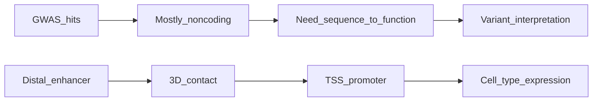

Diagram: my schematic of the motivating problem (not a paper figure).

 
 

- **Noncoding variants** dominate GWAS; mechanisms run through **cis-regulation** (enhancers, promoters, insulators).
- **Experimental validation** does not scale to every variant in every tissue.
- **Computational models** that map **DNA → regulatory readouts** are a complement to population genetics, not a replacement.

<!--
The diagram has two chains reading left to right. The upper chain is genome-wide association hits, then mostly noncoding hits, then the need to go from sequence to function, then variant interpretation—which change might alter regulation or expression in a relevant cell type.

The lower chain is a distal enhancer, then three-dimensional contact in the nucleus, then the promoter at the transcription start site, then cell-type expression. An enhancer can sit far away on the chromosome; folding brings it near the promoter. If a model's receptive field cannot span from enhancer to promoter along sequence, it cannot represent that biology.

Most association signals are noncoding. We cannot run MPRAs or CRISPR screens on every variant in every tissue, so computational models that map DNA to readouts complement population genetics; they do not replace it.

A stronger held-out predictor means the model fit the training assays well; that is not by itself proof of causality in a patient.
-->

---

## 🧭 Background: enhancers, promoters, and TADs

 
 

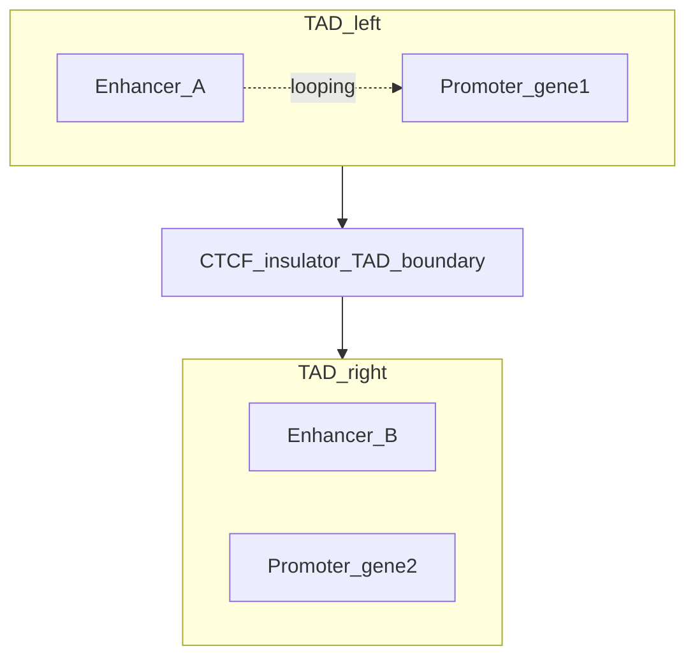

- **Promoter** — region near the **TSS (transcription start site)** where the basal transcription machinery assembles.
- **Enhancer** — regulatory DNA that can lie **tens to hundreds of kb away** on the linear genome yet contact the promoter through **3D folding**.
- **TAD (topologically associating domain)** — megabase-scale compartment; **CTCF-rich boundaries** and **insulators** reduce illegitimate enhancer–promoter crosstalk **across** domains (paper Fig. 2c,d; Discussion).

Diagram: teaching schematic (not a paper figure). Paper uses TAD boundary analysis in Fig. 2.

<!--
On the left, the cartoon shows two topologically associating domains: on the left, enhancer A loops to promoter one; in the middle, a CTCF-rich insulator and TAD boundary; on the right, a second domain with enhancer B and promoter two. The boundary is drawn to block promiscuous enhancer–promoter pairing across domains.

Avsec and colleagues later show attention patterns at real TAD boundaries that look like reduced interaction across the boundary; I'm not claiming this cartoon is a Hi-C map.

The point I want you to carry is that linear distance along the chromosome is not the same as regulatory distance: an enhancer can be hundreds of kilobases away on the DNA string and still regulate a gene. A model that only sees about twenty kilobases from the transcription start site can miss the enhancer entirely.
-->

---

## ⛔ Key limitation of prior CNN models

 
 

**Receptive field (informal):** how far along the sequence a prediction at the TSS can effectively "see."

| Model family (paper) | ~Reach from TSS | High-confidence enhancer–gene pairs "in view" (paper estimate) |
|----------------------|-----------------|---------------------------------------------------------------------|
| **Basenji2 / ExPecto** | **~20 kb** | **47%** within 20 kb |
| **Enformer** | **~100 kb** | **84%** within 100 kb |

 
 

~20 kb

~100 kb

 
 

Percentages: Introduction / Results narrative in Avsec et al. comparing enhancer–gene distances to model reach.

<!--
The table is the paper's own comparison: forty-seven percent of high-confidence enhancer–gene pairs fall within twenty kilobases of the transcription start site, but eighty-four percent fall within one hundred kilobases. Under the table, the short gray bar is about twenty kilobases of reach for Basenji2-style models; the long blue bar is about one hundred kilobases for Enformer. Widening reach changes which experimentally supported pairs the model can even use as supervision, not just a leaderboard number.

When I say receptive field here, I mean how far along the sequence the network can integrate for a prediction at the transcription start site—the information path in the model—not physical three-dimensional distance in the nucleus.
-->

---
class: compact-slide arch-diagram-slide
---

## 🏗️ Enformer architecture (overview)

 

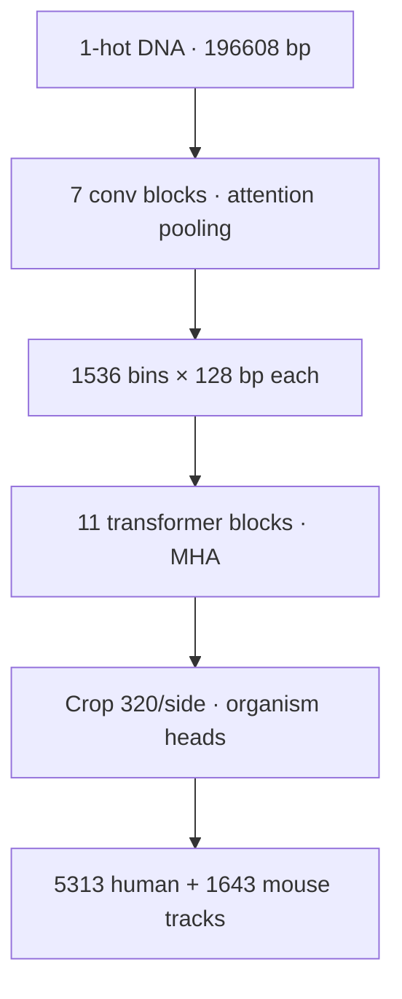

 
<ul style="font-size:0.95em;margin-top:0.25rem">
<li><strong>Paper fact:</strong> 7 conv blocks, 11 transformer blocks, then organism heads (Fig. 1a; Extended Data Fig. 1).</li>
<li><strong>Output window:</strong> <strong>896</strong> bins × <strong>128 bp</strong> = <strong>114,688 bp</strong> of predicted tracks along the sequence center (Methods).</li>
</ul>

<!--
Starting at the top, the input is one-hot DNA of length one hundred ninety-six thousand six hundred eight, including N for unknown bases.

Seven convolutional blocks with attention pooling shrink the length while widening channels until each position represents one hundred twenty-eight base pairs—that is motif-level resolution without running transformers on every single base at full length.

Then come eleven transformer blocks with multi-head self-attention, so every binned position can attend to every other at that stage; in practice that gives you long-range context on the order of one hundred kilobases.

They crop three hundred twenty bins on each side before the loss so edge bins are not evaluated without symmetric sequence context.

Finally, separate human and mouse heads output the multitask tracks. The two bullets under the diagram repeat the block counts and spell out the length of the scored output window along the center in base pairs.
-->

---
class: compact-slide
---

## 🔍 Why self-attention here (vs. dilated CNNs)

 
 

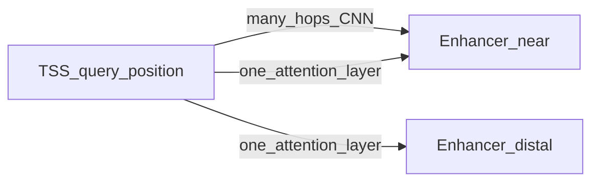

 
 

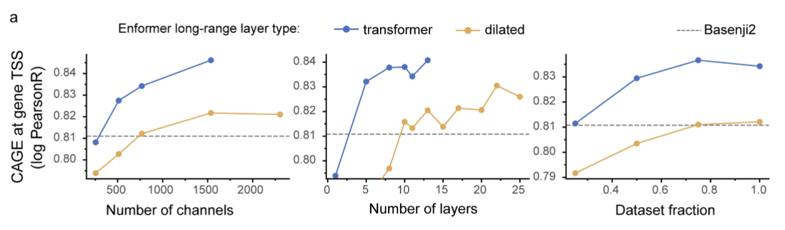

- **Convolution:** local mixing; reaching distal positions needs **many stacked layers** (dilated or not).
- **Self-attention:** each position forms a **weighted sum over all positions**; one layer can link **TSS ↔ distal enhancer** directly (paper Results + Ext. Data Fig. 5a).
- **Relative positional encodings:** custom basis functions (not plain NLP sin/cos) so the model can encode **distance and strand direction** to the TSS (Ext. Data Fig. 6; Methods).

Top: intuition sketch. Bottom: Extended Data Fig. 5a (validation curves).

<!--
The small diagram on the left shows a transcription start site as query, a nearby enhancer, and a distal enhancer. A deep convolutional path needs many hops to reach even the nearby enhancer, while one self-attention layer can connect the query to both nearby and distal positions in one step.

Under that sketch is Extended Data Figure 5a: validation curves where they swap transformer layers for tuned dilated convolutions or shrink the attention neighborhood toward Basenji2-scale reach. Those variants underperform across model sizes and data fractions, and shrinking attention wipes out much of the gain—so attention is doing real work here, not just chasing a trend.

Saying "transformers beat CNNs" is too blunt. The fair statement from this paper is that on multitask regulatory prediction at one hundred twenty-eight base pair bins, their convolutional stem plus global attention beat the best dilated CNN baseline they could train within memory limits.

The bullets on the right say the same thing in short form: convolution mixes locally; attention is a weighted sum over all positions; and they use custom relative positional encodings so the model knows distance and strand relative to the transcription start site, detailed in Extended Data Figure 6 and Methods.
-->

---
class: compact-slide
---

## 🧪 Implementation: data, loss, and training

 
 

| Topic | Detail (paper, Methods) |
|-------|-------------------------|
| **Targets** | **5,313** human tracks (TF ChIP, histone ChIP, DNase/ATAC, CAGE) + **1,643** mouse tracks |
| **Loss** | **Poisson negative log-likelihood** per position vs observed counts (same as Basenji2) |
| **Train / val / test** | **34,021** train, **2,213** val, **1,937** test sequences; **homology-aware** split via syntenic **1 Mb** regions (human–mouse bipartite graph) |
| **Optimization** | **Adam** lr **5×10⁻⁴**, **5k**-step warmup, global grad clip **0.2**, **150k** steps, batch **64** on **64** TPU v3 cores (~**3** days); alternate human/mouse batches |
| **Augmentation** | Random shift up to **3 bp** + **reverse complement** (matches Basenji2) |
| **Fine-tune** | Extra **30k** steps on human at lr **1×10⁻⁴** (paper Methods) |

 
 

Multitask learning: one forward pass predicts thousands of assays simultaneously (same multitask setup summarized visually on the next Results slide, Fig. 1c).

<!--
They train with Poisson negative log-likelihood at each position against observed counts, which matches count-type sequencing reads.

The train, validation, and test split is homology-aware across syntenic megabase blocks, so you do not get an easy cheat where a human test region is trivially paired with a mouse training region.

Basenji2 comparisons use the released weights; the Extended Data Figure 5 ablations retrain smaller-channel models so the comparisons are fair on compute.

Under the table, one line notes that the multitask picture—thousands of tracks at once—shows up as a cloud of points per assay type on Figure 1c in the gene expression results.
-->

---
class: compact-slide
---

## 📈 Results: gene expression (CAGE at TSS)

 
 

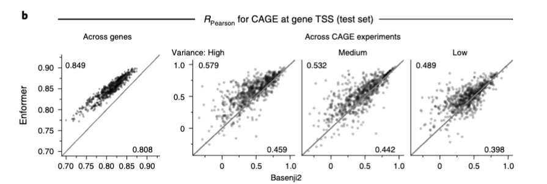

Fig. 1b: Pearson correlation of CAGE at TSS (log(1+x), standardized) — across genes per experiment (left) and across experiments per gene (right). Corner means from the paper figure.

**Paper headline:** mean CAGE correlation **0.81 → 0.85** across genes; improvement **~2×** the Basenji1→Basenji2 jump; closes **~⅓** of the gap to an **~0.94** replicate-level ceiling (Ext. Data Fig. 2; narrative in Results).

**Statistical test:** paired **Wilcoxon**, **P < 10⁻³⁸** vs Basenji2 on Fig. 1b/c-style comparisons (paper).

<strong>Framing:</strong> strong held-out performance on gene bodies and TSS readouts; still not an experimental replicate.

<!--
Figure 1b shows two scatter panels: in one, each point is a CAGE experiment; in the other, each point is a gene. The axes are Pearson correlation on log-one-plus counts at the transcription start site, with the standardization written in the figure caption, comparing Enformer to Basenji2. Corner means are printed on the figure when the export includes them.

Mean CAGE correlation across genes goes from zero point eight one to zero point eight five—that improvement is about twice the jump from Basenji1 to Basenji2, and it closes roughly a third of what remains to a zero point nine four replicate ceiling from Extended Data Figure 2.

That does not mean you cancel wet-lab CAGE in a brand-new cell type. It means that trained on a large compendium, Enformer's predictions match held-out chromosome CAGE better than Basenji2.
-->

---
class: compact-slide
---

## 📊 Results: all four assay classes (human test)

 
 

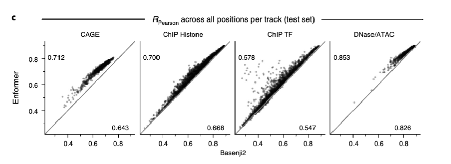

Fig. 1c: each dot is one of <strong>5,313</strong> tracks — Pearson correlation across all 128-bp bins on held-out human sequence (paper).

- **CAGE, ChIP histone, ChIP TF, DNase/ATAC** — Enformer **> Basenji2** for every dot cloud (paired **Wilcoxon**, **P < 10⁻³⁸**).
- **Interpretation:** the receptive-field upgrade helps **more than just one assay type**; largest gains emphasized for **CAGE** (distal regulation; paper Discussion).

<!--
Figure 1c is four columns—CAGE, ChIP histone, ChIP transcription factor, and DNase or ATAC—with one dot per track out of five thousand three hundred thirteen, comparing Enformer to Basenji2 on Pearson correlation along the genome.

So the improvement is not a single-assay cherry-pick: every cloud shifts upward versus Basenji2 with the same paired Wilcoxon statement as in the paper.

Histone and accessibility improve too; the paper emphasizes the largest relative lift for CAGE, which fits the story that distal regulation drives a lot of tissue-specific expression.
-->

---
class: compact-slide
---

## 🧲 Results: enhancer prioritization (CRISPRi)
 
 

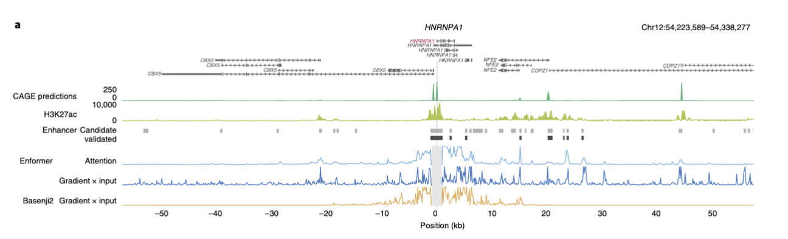
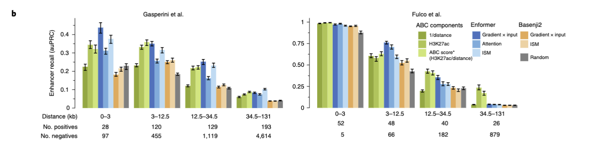

Fig. 2a–b: contribution scores (gradient×input, attention, ISM) vs CRISPRi-validated enhancer–gene pairs (Gasperini; Fulco). Enformer **DNA-only** scores vs **ABC** (often uses Hi-C + H3K27ac; paper).

<!--
Figure 2a is a locus strip—read the tracks from bottom to top: predicted K562 CAGE, measured H3K27ac, candidate versus CRISPRi-validated enhancers, then Enformer versus Basenji2 gradient-times-input and attention. Basenji2's attributions fall toward zero past about twenty kilobases, so they never light up distal validated enhancers; Enformer does.

Figure 2b summarizes enhancer–gene pairs with area under the precision–recall curve versus distance on the Gasperini and Fulco CRISPRi maps. Enformer and its scoring variants beat Basenji2 and random baselines and sit near ABC-style scores that normally lean on Hi-C and chromatin experiments, while Enformer here is DNA-only at prediction time.

Attention is not a causal certificate—it is an internal weighting—but in this paper it lines up with the perturbation maps.
-->

---
class: compact-slide
---

## 🏛️ Results: TAD boundaries and insulator-like behavior

 
 

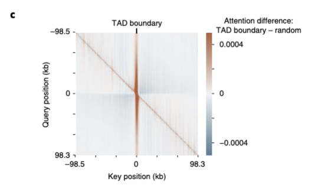

- **On this slide — Fig. 2c:** average attention-matrix **difference** for **1,500** sequences centered on **TAD boundaries** vs matched random controls — **more** attention on the **boundary stripe**; **less** attention **across** the boundary (**blue** off-diagonal blocks vs random centering).
- **Also in the paper (not shown here):** **Fig. 2d** quantile plots (**across-TAD** down, **at-boundary** up; Mann–Whitney); **Ext. Data Fig. 8** — **CTCF**-like motifs from gradient×input at boundaries (**unsupervised**).

Fig. 2c (heatmap): interpretability evidence from sequence, not a clinical claim.

<!--
Figure 2c is a square difference heatmap of attention centered on topologically associating domain boundaries. Rows are query positions and columns are key positions. You see a warmer vertical stripe right on the boundary—extra attention at the boundary—and bluer off-diagonal blocks, meaning less attention from one side of the boundary to the other than when you center on matched random controls.

That pattern matches textbook insulation: the model is not claiming to replace a Hi-C map; it is showing sequence-level consistency with known nuclear organization.

I also want to name Figure 2d quantiles and Extended Data Figure 8, where CTCF-like motifs emerge from gradient-times-input at boundaries without anyone labeling for CTCF—those panels are in the paper but I am not showing them here.
-->

---
class: compact-slide
---

## 🧬 Results: eQTLs, SLDP, and fine-mapped causal variants

 
 

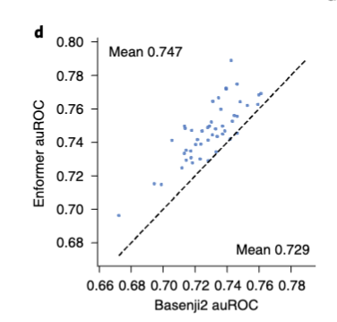

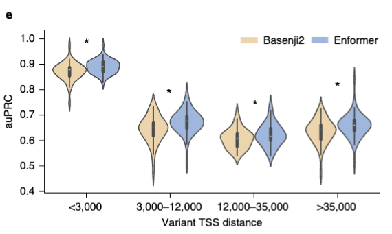

<strong>On this slide:</strong> Fig. 3d (left), Fig. 3e (right). <strong>Fig. 3a–c</strong> in the paper report **SLDP** (genome-wide, LD-aware concordance with GTEx) — summarized in the bullets, not reproduced here.

<ul style="font-size:0.9em;margin:0.35rem 0 0 0">
<li><strong>Fine-mapped classification (Fig. 3d; SuSiE PIP):</strong> random forests on **Δprediction** features — **47 / 48** tissues favor Enformer; mean **auROC 0.729 → 0.747**.</li>
<li><strong>Distance bins (Fig. 3e):</strong> gains at **all** TSS-distance bins (paired Wilcoxon **P < 10⁻⁴**).</li>
<li><strong>SLDP (signed LD profile; paper Fig. 3a–c):</strong> genome-wide concordance of **signed variant scores** with **GTEx** eQTL summary stats accounting for **LD** — higher Z is better; Enformer wins broadly vs Basenji2 in the paper’s SLDP panels.</li>
</ul>

<!--
On the left, Figure 3d is a tissue-by-tissue scatter of area under the ROC for fine-mapped GTEx variants using SuSiE high-posterior inclusion probability positives, Enformer on one axis and Basenji2 on the other, with corner means when the figure export includes them. On the right, Figure 3e bins variants by distance to the transcription start site and compares models—distance-binned violins in the full paper.

Signed LD profile regression for genome-wide concordance with GTEx while accounting for linkage disequilibrium is in Figures 3a through 3c in the paper; I am only summarizing that block in words here, not reproducing those panels.

For SLDP, they score reference versus alternate forward passes and ask whether those signed scores line up with GTEx summary statistics while respecting LD. In the paper's headline count, three hundred seventy-nine of six hundred forty-eight CAGE setups gain in maximum cross-tissue Z for Enformer over Basenji2; two hundred twenty-eight move up by more than one sigma and forty-six move down by that much. That is broad movement, not a solved fine-mapping problem.

For fine-mapped classification, they train random forests on delta-prediction features using SuSiE high-PIP causal variants against matched negatives. Forty-seven of forty-eight tissues favor Enformer, and mean area under the ROC rises from zero point seven two nine to zero point seven four seven.

That still does not prove Enformer always names the true causal base in vivo; it shows their sequence-derived features carry more signal for that classifier than Basenji2's do.
-->

---
class: compact-slide
---

## 🧫 Results: MPRA saturation mutagenesis (CAGI5)

 

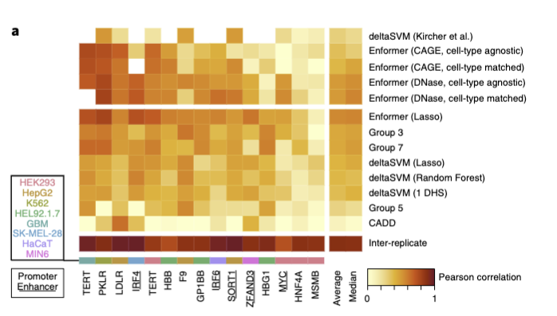
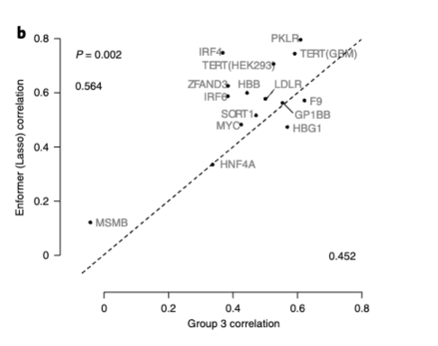

Fig. 4: 15 disease-linked loci, CAGI5 train/test splits; compare Enformer (lasso on 5,313 Δfeatures, or training-free PC summary) vs competing methods (paper).

<ul style="font-size:0.9em">
<li><strong>Headline:</strong> Enformer lasso best average correlation across loci vs seven other method families; beats CAGI5 winning Group 3 (paired one-sided Mann–Whitney, P = 0.002, Fig. 4b).</li>
<li><strong>Training-free scores</strong> from Enformer still competitive — strong inductive bias from multitask sequence training (paper Discussion).</li>
</ul>

<!--
Figure 4a is a horizontal bar chart of how well each method's predicted variant effects correlate with measured massively parallel reporter assay readouts across fifteen disease-linked loci from CAGI5, with fixed train-test splits for a fair bake-off.

Figure 4b scatters Enformer's lasso correlation against the CAGI5 winning Group 3 submission per locus, with corner summaries on the figure.

MPRA measures variant effects in reporter assays at scale; CAGI5 standardized fifteen loci so methods could be compared apples to apples.

When they say training-free, they sometimes skip per-locus lasso and score variants from a principal-component summary of a subset of delta-prediction features, and those scores still beat many submitted pipelines—the paper discusses that in the Discussion.

The paper also shows a LDLR saturation example in Figure 4c where predicted tracks track measurements and known motifs better than deltaSVM on that locus; I am only showing Figures 4a and 4b here.

None of this replaces prospective clinical validation or exhaustive cell-type coverage.
-->

---
class: compact-slide
---

## 🌟 Strengths (what the paper actually contributes)

 
 

| Contribution | Evidence (paper) | Why it matters |
|--------------|------------------|----------------|
| **Long-range receptive field ~100 kb** | vs ~20 kb Basenji2/ExPecto; ablations Ext. Data Fig. 5 | Captures most high-confidence enhancer–gene pairs in their estimate |
| **Multitask sequence → tracks** | 5,313 human + 1,643 mouse outputs; Poisson training | One model shares statistical strength across assays |
| **Enhancer prioritization from DNA** | Fig. 2 vs CRISPRi + ABC comparisons | Prioritization without Hi-C at prediction time |
| **Variant-effect benchmarks** | GTEx fine-mapping + MPRA / CAGI5 | Bridges population genetics + functional assays |

<!--
First, Enformer reaches on the order of one hundred kilobases of sequence context versus about twenty for Basenji2 or ExPecto, with ablations in Extended Data Figure 5, and that matters because most high-confidence enhancer–gene pairs in their estimate fall inside the longer window.

Second, one forward pass predicts thousands of human and mouse tracks with Poisson training, so statistical strength is shared across assays.

Third, enhancer prioritization from DNA alone is benchmarked against CRISPRi maps and ABC-style scores in Figure 2.

Fourth, variant-effect benchmarks tie sequence models to GTEx fine-mapping and to MPRA and CAGI5, bridging population genetics and functional assays.
-->

---
class: compact-slide
---

## ⚠️ Limitations and improvements

 
 

**[SOURCE: paper] — authors highlight**

- Only **cell types / assays present in training**; **no zero-shot** to unseen tissues or marks without new data.
- **3D contacts** (Hi-C, etc.) are **not** explicit inputs; artful fusion with sequence models like **Akita / DeepC** could help (Discussion cites Fudenberg, Schwessinger).
- **Resolution vs compute:** 128 bp bins trade off against quadratic attention cost; finer bins need more memory (Discussion).
- **Variant sensitivity** could improve with **more CRISPR / MPRA** used as training signal, not only evaluation (Discussion).

<strong>[Context beyond the paper — my critique]</strong>

- **Correlation ≠ mechanism:** better tracks do not automatically yield causal narratives in patients.
- **Tissue matching is hard:** SLDP and eQTL analyses required manual CAGE–GTEx matching; mismatches dilute signal (Methods acknowledge skipping ambiguous cases).
- **Sign prediction at distal sites:** Ext. Data Fig. 10 shows **both models struggle** when variants are far from promoters — honest frontier.
- **Deployment:** compute, calibration, prospective validation, and equity across ancestries remain outside this paper's scope.

<!--
In their Discussion, the authors stress that you only get cell types and marks that were in training; Hi-C is not an explicit input and fusion with structure models like Akita or DeepC could help; one hundred twenty-eight base pair bins trade off against quadratic attention cost; and they could use more CRISPR or MPRA as training signal, not only evaluation.

Separately, better correlation on predicted tracks does not automatically give you causal mechanism in a patient; matching CAGE tracks to GTEx tissues was manual and messy, and Methods say they skipped ambiguous cases; Extended Data Figure 10 shows both models still struggle on sign prediction when variants sit far from promoters; and turning any of this into deployed medicine still needs compute, calibration, prospective validation, and ancestry-aware checks.
-->

---

## 🔬 Translational framing + course bridge

 
 

<strong>Paper stance:</strong> improved fine-mapping and variant prioritization are **scientifically plausible** next steps; authors release **precomputed** 1000 Genomes scores to lower the engineering barrier.

<strong>[Context beyond the paper — Anton]</strong>

- **Clinical genomics** still needs **prospective validation**, appropriate **intended-use** scoping, and **laboratory follow-up** — Enformer is not a standalone diagnostic.
- **Course bridge (CS781 Paper Ideas memo):** the first anchor talk was **EHR representation learning**; Enformer is the **sequence-to-function** anchor. Connecting **AoU (All of Us)** respiratory phenotypes to **cis-regulatory** hypotheses is a natural place for models like Enformer for **prioritizing noncoding variants** — but **not** a substitute for cohort design, ancestry-aware validation, and wet-lab confirmation.

<!--
The paper itself says improved fine-mapping and variant prioritization are plausible next steps, and they released precomputed thousand-genomes scores to lower the engineering barrier.

Separately, in clinical genomics we still need prospective validation, clear intended use, and wet-lab follow-up—Enformer is not a standalone diagnostic.

For this course, the first anchor talk was electronic health record representation learning; Enformer is the sequence-to-function anchor. Connecting All of Us respiratory phenotypes to cis-regulatory hypotheses is a natural place to use a model like Enformer to prioritize noncoding variants, but that idea comes from our course memo, not from the Enformer paper, and it is not a substitute for cohort design, ancestry-aware validation, or confirmation in the lab.
-->

---

## 🎯 Key takeaways

 
 

| For the paper (facts + claims they support) | Takeaway (how to read it) |
|---------------------------------------------|----------------------------------------|
| **~100 kb** receptive field improves **multitask** prediction vs **Basenji2** | Ask **which enhancers** enter the window for your variant of interest |
| **Attention + custom relative PEs** beat **dilated CNN** ablations in their sweeps | It is **architecture + inductive bias**, not a transformer trophy |
| **Strong** enhancer prioritization + **GTEx / MPRA** benchmarks | Benchmarks test **specific pipelines**; **LD / tissue matching** matter |
| **Released weights + variant scores** | Useful **research tool**; **not** automatic clinical truth |

<!--
Longer receptive field and multitask training beat Basenji2 in their setup—when you use this in your own work, ask which enhancers actually fall inside the window around your variant of interest.

Attention plus their custom relative positional encodings beat dilated CNN ablations in their sweeps—that is architecture and inductive bias together, not a trophy for the word "transformer."

They show strong enhancer work and solid GTEx and MPRA benchmarks, but every benchmark is a specific pipeline; linkage disequilibrium and tissue matching still matter.

Released weights and variant scores make a useful research tool; they are not automatic clinical truth.

Enformer is a useful twenty twenty-one snapshot of how far sequence-to-function models had come before even larger models took off; it pairs strong benchmarks with honest limits on generalization and mechanism.
-->

---

## 📚 References

 
 

**Primary**

- Avsec, Ž., Agarwal, V., Visentin, D., Ledsam, J. R., Grabska-Barwińska, A., Taylor, K. R., Assael, Y., Jumper, J., Kohli, P., & Kelley, D. R. (2021). Effective gene expression prediction from sequence by integrating long-range interactions. *Nature Methods*, 18, 1196–1203. https://doi.org/10.1038/s41592-021-01252-x

**Key dependencies cited in talk (selection)**

- Kelley, D. R. et al. Basenji / Basenji2 (cross-species regulatory prediction). *PLoS Comput. Biol.* / *Genome Res.* (as in Enformer references).
- Gasperini, M. et al.; Fulco, C. P. et al. CRISPRi enhancer maps (Fig. 2).
- GTEx Consortium; Wang et al. SuSiE fine-mapping resource (Fig. 3).
- Kircher et al. saturation mutagenesis; Shigaki et al. CAGI5 (Fig. 4).

<!--
This list is the primary citation plus the dependencies I name aloud—Basenji and Basenji2, the Gasperini and Fulco CRISPRi maps, GTEx and SuSiE fine mapping, and Kircher and Shigaki for saturation mutagenesis and CAGI5. The paper's full bibliography is longer; this is the short list that matches what I cited in the talk.
-->

---

## 🙏 Thank you

<!--
Thank you for listening. Have a great day!
-->
