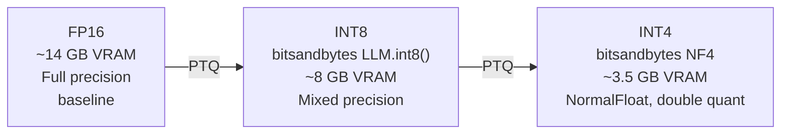
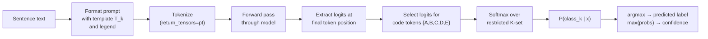
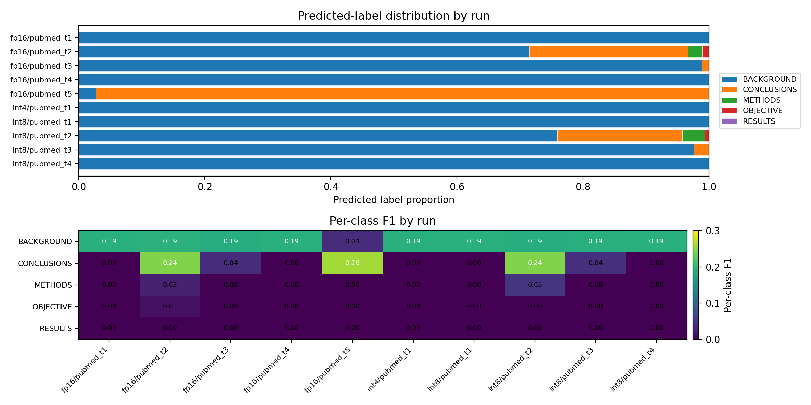
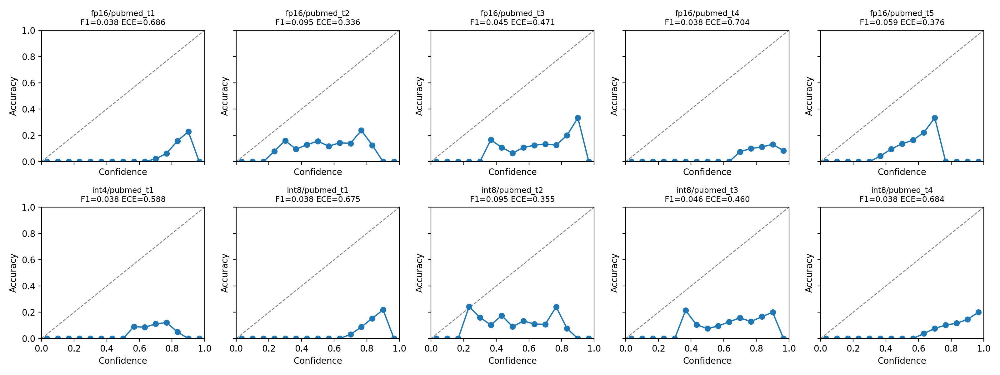
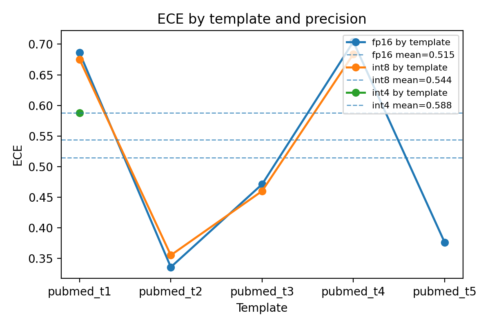
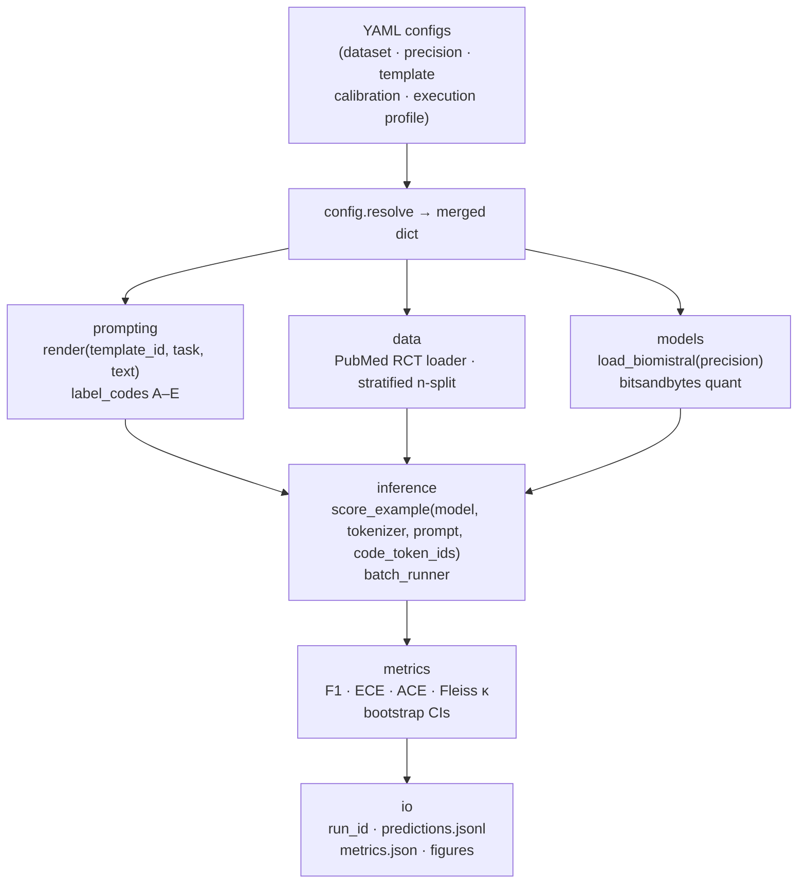

# Beyond Accuracy Loss in Quantized Biomedical LLMs

## Calibration and Prompt Stability Under Resource Constraints

<br>

**Anton Rasmussen**  
CS781 — AI for Health Sciences  
Spring 2026

<!--
Hello. Today I'm presenting my final project for CS781, "Beyond Accuracy Loss in Quantized Biomedical LLMs."

The central question I'm exploring is whether post-training quantization of a biomedical language model harms calibration more than it harms classification accuracy—and whether standard post-hoc methods can recover that loss. Along the way, the experiments surfaced a dominant finding I didn't anticipate: label collapse driven by prompt-template sensitivity that was already present at full precision, before any quantization.

I'll walk through motivation, methods, the full results matrix, and what this means for deploying compressed models in healthcare-adjacent contexts.
-->

---
class: compact-slide
---

## 🗺️ Outline

<br>

1. **Motivation** — why calibration matters in healthcare AI
2. **Background** — quantization and ECE
3. **Research hypotheses** — what we set out to test
4. **Model and task** — BioMistral-7B on PubMed RCT
5. **Methods** — single-token scoring, prompt templates, metrics
6. **Results** — evidence matrix, metrics, and the label collapse finding
7. **Discussion** — hypothesis outcomes and deployment implications
8. **Code demo** — the evaluation pipeline
9. **Limitations and future work**
10. **Acknowledgements and references**

<!--
Here's what we'll cover. We'll go through the motivation, background on both quantization and calibration, the three formal hypotheses, the model and task, the methods, then the full results. I'll spend time on the label-collapse finding because it reframes the entire analysis. Then a live code walkthrough, limitations, and a close.
-->

---
class: compact-slide
---

## 🏥 Motivation: why calibration matters

<br>

<div class="hybrid-grid">
<div class="hybrid-col-text">

**The deployment reality:**

Healthcare organizations want to run LLMs for documentation support, triage assistance, and literature analysis—but 7B models require ~14 GB VRAM at FP16.

A 4-bit quantized variant fits in **~3.5 GB**: deployable on consumer GPUs or CPU-only infrastructure.

</div>
<div class="hybrid-col-text">

**The calibration gap:**

Existing evaluations focus almost entirely on **aggregate accuracy**. In safety-critical settings, that's insufficient. Two properties matter more:

1. **Calibration** — does confidence align with correctness probability?
2. **Prompt robustness** — are predictions stable across equivalent phrasings?

<div class="callout callout-warn"><strong>A model that is 92% accurate but assigns 99% confidence to every prediction (including the 8% it gets wrong) is actively dangerous in decision-support contexts.</strong></div>

</div>
</div>

<!--
Let's start with why this matters. Seven-billion-parameter models like BioMistral-7B are excellent biomedical NLP workloads, but they're expensive. Fourteen gigabytes at FP16 exceeds most commodity hardware. INT4 quantization cuts that to about three-and-a-half gigabytes—making it practical to run on a workstation or a single-GPU server.

The problem is that most evaluations of quantized models stop at accuracy. But accuracy alone is the wrong metric for clinical decision support. Calibration—whether confidence scores actually mean something—matters enormously. A model that confidently wrong is more dangerous than one that is appropriately uncertain.

And prompt robustness matters too: if a model's output flips when a clinician rephrases a question, it's unreliable regardless of its average accuracy.
-->

---
class: compact-slide
---

## 📐 Background: post-training quantization

<br>



<br>

| Condition | Method | Backend | VRAM savings |
|-----------|--------|---------|--------------|
| **FP16** | `torch.float16` | Native | baseline |
| **INT8** | `LLM.int8()` (Dettmers et al., 2022) | bitsandbytes | ~2× |
| **INT4** | NF4, double quantization (Dettmers et al., 2023) | bitsandbytes | ~4× |

<br>

**Design choice:** single backend (bitsandbytes) throughout — so observed differences reflect **precision**, not backend implementation differences.

<!--
Post-training quantization means we take a pretrained model and reduce the bit-width of its weights after the fact—no retraining required. I evaluated three conditions: FP16 as the full-precision baseline, INT8 using bitsandbytes' LLM.int8 mixed-precision method from Dettmers 2022, and INT4 using the NF4 normalfloat format with double quantization from the QLoRA paper in 2023.

Using a single backend is a deliberate design choice. Different backends—GPTQ, AWQ, llama.cpp—use different kernel implementations. If I used multiple backends, any observed differences could reflect implementation choices rather than precision effects. Fixing to bitsandbytes isolates precision as the independent variable.
-->

---
class: compact-slide
---

## 📏 Background: calibration and ECE

<br>

<div class="hybrid-grid">
<div class="hybrid-col-text">

**Expected Calibration Error (ECE):**

Divide predictions into $B$ equal-width confidence bins. For each bin $b$:

$$\text{ECE} = \sum_{b=1}^{B} \frac{|B_b|}{n} \left| \text{acc}(B_b) - \text{conf}(B_b) \right|$$

A **perfectly calibrated** model has ECE = 0.  
A model that always predicts 100% confidence on a 10.5% accuracy task has ECE ≈ 0.90.

</div>
<div class="hybrid-col-text">

**Two complementary variants:**
- **ECE** (equal-width bins): standard; can be unstable when confidence distribution is skewed
- **ACE** (equal-mass bins): more robust when predictions cluster in a narrow confidence range

**Also computed:**
- Macro F1 (primary classification metric)
- Reliability diagrams (visual calibration diagnostic)
- **Fleiss' κ** (inter-template agreement = prompt robustness)

</div>
</div>

<!--
Expected Calibration Error bins predictions by confidence level and measures how well the average confidence in each bin matches the actual accuracy in that bin. A perfectly calibrated model has ECE zero. A model that collapses to predicting a single class with high confidence on a task where that class appears in only ten percent of examples will have an ECE close to ninety percent.

I computed both equal-width ECE and equal-mass ACE as a robustness check. As we'll see, they turn out to be numerically identical across all completed runs—and understanding why is one of the key findings.
-->

---
class: compact-slide
---

## 🎯 Research hypotheses (preregistered)

<br>

| # | Hypothesis | Operationalization |
|---|------------|-------------------|
| **Primary** | INT4 quantization degrades ECE more than F1, relative to FP16 | Paired bootstrap CI on \|Δ_ECE\| − \|Δ_F1\| must be **positive** and exclude 0 |
| **Secondary** | Temperature scaling recovers ECE to ≤ 110% of FP16 baseline | After post-hoc calibration: ECE_calibrated ≤ 1.10 × ECE_FP16 |
| **Tertiary** | INT4 increases prompt sensitivity; **not** recovered by temperature scaling | Fleiss' κ decreases at INT4 and remains low after calibration |

<br>

**Why these three:** they test separable failure modes — *accuracy loss* (F1), *confidence quality* (ECE), *output stability* (κ) — and whether post-hoc calibration fixes the fixable ones.

<!--
The project preregistered three hypotheses before running any experiments. The primary hypothesis is that quantization harms confidence quality—ECE—disproportionately more than it harms classification utility—F1—at INT4. This would mean the model's predictions become less trustworthy faster than they become less accurate.

The secondary hypothesis is that temperature scaling, a simple one-parameter post-hoc calibration method, can recover that lost calibration.

The tertiary hypothesis is that even if calibration is recovered, prompt instability—measured by Fleiss' kappa across five templates—remains degraded at INT4. In other words, two distinct failure modes: one recoverable, one not.

Pre-registering these specific operationalizations before running experiments is important for preventing p-hacking and keeping claims honest.
-->

---
class: compact-slide
---

## 🧬 Model: BioMistral-7B

<br>

| Property | Value |
|----------|-------|
| **Model** | `BioMistral/BioMistral-7B` |
| **Architecture** | Mistral-7B decoder (causal LM) |
| **Pretraining** | General + biomedical continued pretraining on PMC Open Access |
| **Parameters** | ~7 billion |
| **VRAM (FP16)** | ~14 GB |
| **Access** | Open weights, HuggingFace |
| **Citation** | Labrak et al., 2024 (ACL Findings) |

<br>

**Why BioMistral-7B:** 7B is the scale where quantization produces deployment-relevant savings. Biomedical continued pretraining provides domain relevance without requiring restricted data access. Decoder architecture makes the probability extraction methodology non-trivial—and that's the interesting part.

<!--
I chose BioMistral-7B because it sits at exactly the scale where quantization starts to matter practically. Below 7B you can often run full precision on consumer hardware; above 13B the memory savings from INT4 become even more dramatic. BioMistral is Mistral-7B continued-pretrained on PubMed Central Open Access text, so it should have strong biomedical language understanding.

Critically, it's a decoder model. That makes calibration analysis non-trivial—we can't just read class probabilities off a classification head. We have to extract probabilities from the next-token logits, and that design decision is a major methodological contribution of this work.
-->

---
class: compact-slide
---

## 📄 Task: PubMed RCT sentence classification

<br>

<div class="hybrid-grid">
<div class="hybrid-col-text">

**PubMed 200k RCT** (Dernoncourt & Lee, 2017):

- ~200,000 labeled sentences from 20,000 structured medical abstracts
- Each sentence labeled with its **rhetorical role**:

| Code | Label |
|------|-------|
| **A** | Background |
| **B** | Objective |
| **C** | Methods |
| **D** | Results |
| **E** | Conclusions |

- 5-class structure → richer signal for calibration than binary tasks
- Large volume → stable bootstrap estimates

</div>
<div class="hybrid-col-text">

**Example sentence:**

> *"We conducted a double-blind randomized controlled trial..."*

→ **C (Methods)**

<br>

**Evaluation slice:** stratified random sample, **n = 2,000** per run

**MedNLI status:** deferred — data access (PhysioNet credentialing) blocked throughout the project. PubMed RCT is the complete, defensible story.

</div>
</div>

<!--
The task is sequential sentence classification on PubMed RCT: given a sentence from a structured medical abstract, classify it into one of five rhetorical roles—Background, Objective, Methods, Results, or Conclusions. These map to the single-letter codes A through E.

I chose this task for several reasons: it's open access with no credentialing, it's a well-established benchmark, the five-class structure gives richer calibration signal than a binary task, and the large volume enables stable bootstrap confidence intervals.

MedNLI—the clinical natural language inference task—was in the original proposal but remained blocked throughout. The PhysioNet data use agreement was never resolved. So PubMed RCT is the complete, defensible story, as the proposal's fallback path specified.
-->

---
class: compact-slide arch-diagram-slide
---

## ⚙️ Methods: single-token class-code scoring

<br>



<br>

**Why not natural-language verbalizers?** Scoring the first token of label names like "Background" or "Methods" creates fragile dependencies: multi-token labels, leading-space sensitivity, and shared first-token collisions silently corrupt the probability distribution.

**Why not free-form generation?** It loses probability information and makes calibration measurement ill-defined.

**Single-letter codes A–E are each a single token in any BPE tokenizer.** The restricted softmax over exactly those five tokens produces a proper probability distribution suitable for ECE computation.

<!--
This is the core methodological contribution. For a decoder language model, there's no classification head to read probabilities from. We have to extract them from the next-token logit vector.

The key insight is to map class labels to single-letter codes—A through E—that are guaranteed to be single tokens in any byte-pair encoding tokenizer. We run a forward pass, extract the logit vector at the final token position, select only the logits for tokens A through E, and apply softmax over just those five logits. This produces a proper five-dimensional probability distribution.

Natural-language verbalizers—scoring the first token of "Background" or "Methods"—seem intuitive but are fragile. Tokenization is context-sensitive: a leading space changes the token ID. Multi-token labels make the probability ill-defined. Single-letter codes eliminate all of these problems.
-->

---
class: compact-slide
---

## 📝 Methods: five meaning-preserving prompt templates

<br>

| ID | Variation | Key surface difference |
|----|-----------|----------------------|
| **t1** | Standard | "Classify the following sentence... Answer with a single letter." |
| **t2** | Assignment | "Assign the sentence to exactly one category... Return only one letter." |
| **t3** | Numbered + re-indexed | Categories listed 1–5 then re-mapped to A–E; explicitly numbered |
| **t4** | Legend-first | Legend appears before the task instruction, then sentence |
| **t5** | Inline codes | `A=BACKGROUND  B=OBJECTIVE ...` as inline key-value list |

<br>

**Validation gate:** All templates validated on 50 dev examples at FP16 — confirmed same modal prediction on ≥90% of dev examples.

**Prohibited variation:** adding reasoning cues, changing class-code mapping, restructuring task framing. *Only* surface/syntactic variation is permitted — we are measuring robustness, not instruction-following differences.

<!--
The prompt robustness analysis uses five templates that vary only surface form—the instructions are rephrased, the presentation of the legend changes, the sentence order shifts—but the task semantics and the class-code mapping are held constant.

This constraint is critical. If templates varied in reasoning cues or few-shot examples, we'd be measuring instruction-following differences, not robustness. All five templates were validated on fifty development examples before the full n-2000 runs to confirm they produce consistent predictions at full precision.

Template t3 is the most interesting: it lists categories numerically (1 through 5) and then asks the model to map to the alphabetic codes A through E in the same order. This tests whether the model follows the mapping instruction or defaults to some internal ordering.
-->

---
class: compact-slide
---

## 🧮 Methods: metrics and inference rules

<br>

| Metric | What it measures | Decision rule |
|--------|-----------------|---------------|
| **Macro F1** | Classification quality (class-imbalance aware) | Primary precision-vs-FP16 comparison |
| **ECE** (15 equal-width bins) | Calibration quality | Main calibration metric |
| **ACE** (15 equal-mass bins) | Calibration quality, robustness check | Should agree directionally with ECE |
| **Bootstrap CIs** | Statistical uncertainty | n=1,000 resamples, percentile method, seed 42 |
| **Fleiss' κ** | Inter-template prediction agreement | Prompt robustness proxy |
| **Reliability diagrams** | Visual calibration diagnostic | Qualitative per-run inspection |

<br>

**Primary hypothesis decision rule:** Paired-bootstrap CI on (|Δ_ECE| − |Δ_F1|) must **exclude zero and be positive** to count as support.

**Secondary hypothesis decision rule:** ECE after temperature scaling ≤ 1.10 × ECE_FP16.

**Tertiary decision rule:** Fleiss' κ at INT4 is lower than FP16; remains low after temperature scaling.

<!--
For metrics, macro F1 accounts for class imbalance—which matters here because the five PubMed RCT classes are not equally distributed. ECE with fifteen equal-width bins is the standard calibration metric; ACE with fifteen equal-mass bins is a robustness check that's more stable when the confidence distribution is highly skewed.

Bootstrap confidence intervals use a thousand resamples with the percentile method at a fixed seed for reproducibility. Fleiss' kappa measures how much the five templates agree with each other, treating each template as an independent rater.

The decision rules for each hypothesis are preregistered: the primary requires a positive CI excluding zero; the secondary requires recovery to within ten percent of the FP16 ECE; the tertiary requires kappa to degrade and not recover after calibration.
-->

---
class: extra-compact-slide
---

## 🧪 Methods: experimental design (the full matrix)

**Target:** 3 precisions × 5 templates = **15 cells** at n = 2,000 per cell — **10 / 15 completed**

<div style="text-align:center">

| | t1 | t2 | t3 | t4 | t5 |
|---|---|---|---|---|---|
| **FP16** | ✅ | ✅ | ✅ | ✅ | ✅ |
| **INT8** | ✅ | ✅ | ✅ | ✅ | ❌ |
| **INT4** | ✅ | ❌ | ❌ | ❌ | ❌ |

</div>

| Blocked cell | Failure mode |
|---|---|
| INT8 / t5 | `bitsandbytes` constructor mismatch at runtime |
| INT4 / t2–t5 | Meta-tensor loader errors — weights not materialized before quantization |

All claims are limited to the 10 completed cells.

<!--
The design called for 15 cells: three precisions by five templates, each at n equals two thousand examples. Ten of fifteen cells completed successfully.

INT8/t5 failed with a bitsandbytes constructor mismatch at the quantized-model loading stage. The root cause is a runtime incompatibility in bitsandbytes rather than anything specific to prompt content. INT4/t2 through t5 failed with meta-tensor loader errors: the model weights were not fully materialized in memory before quantization was attempted, causing a cascade of errors.

These failures are documented with specific run IDs and error messages in the repository's run_ids_manifest. All claims in this presentation are scoped to the ten completed cells. I will not extrapolate to the missing cells.
-->

---
class: extra-compact-slide
---

## 📊 Results: the full metrics table (n = 2,000 per run)

<style>
table { font-size: 0.78em !important; }
table td, table th { padding: 0.08em 0.4em !important; line-height: 1.15 !important; }
</style>

<br>

| Precision | Template | Acc | Macro F1 | ECE |
|-----------|----------|-----|----------|-----|
| **fp16** | t1 | 0.1055 | 0.0382 | 0.6861 |
| **fp16** | t2 | 0.1330 | 0.0955 | 0.3360 |
| **fp16** | t3 | 0.1055 | 0.0451 | 0.4713 |
| **fp16** | t4 | 0.1055 | 0.0382 | 0.7040 |
| **fp16** | t5 | 0.1470 | 0.0592 | 0.3764 |
| **int4** | t1 | 0.1055 | 0.0382 | 0.5876 |
| **int8** | t1 | 0.1055 | 0.0382 | 0.6752 |
| **int8** | t2 | 0.1315 | 0.0953 | 0.3555 |
| **int8** | t3 | 0.1060 | 0.0461 | 0.4602 |
| **int8** | t4 | 0.1055 | 0.0382 | 0.6839 |

<br>

<div class="callout callout-warn"><strong>Key signals:</strong> ECE = ACE for every row (concentration diagnostic). 5/10 runs show complete single-label collapse (Background); remaining 5 are heavily skewed. t2 and t5 are the exceptions (less collapse; F1 0.095 and 0.059).</div>

<!--
Here is the full finalized evidence matrix. Let me highlight the patterns.

First: five of ten runs show complete single-label collapse—they predicted Background for all two thousand examples. These five have F1 of 0.0382, which is exactly what you get when only one class is ever predicted. The other five runs have accuracy near 0.1055 as well, but their slightly higher F1 values confirm they are heavily skewed rather than literally single-label.

Second: ECE equals ACE for every single row. When I saw this, it was a diagnostic. Equal-width and equal-mass binning should differ unless the confidence distribution is so concentrated in one region that the bins end up identical. That's another collapse signature.

t2 and t5 are the exceptions—t2 with F1 0.095 and ECE 0.336, t5 with F1 0.059 and ECE 0.376—because their phrasings induced less collapse and the model spread predictions across more classes.
-->

---

## 🔍 Results: label collapse — the dominant finding

<br>



<p class="fig-caption">Label-distribution histograms for all 10 completed runs. 5/10 runs predict a single class (Background) for all 2,000 examples. The remainder are heavily one-label-skewed.</p>

<!--
This figure shows the label distribution predicted by each run. The x-axis is label A through E; the y-axis is count out of two thousand.

The left five panels are all FP16 runs. Templates t1 and t4 show complete single-label collapse—Background for every example. Template t3 is nearly as extreme, but it does produce a handful of non-Background predictions, so it is best described as heavily skewed rather than literal single-label. Templates t2 and t5 show some spread. The right panels are INT8 runs, and the pattern is nearly identical: t1 and t4 collapse completely, t3 is heavily skewed, and t2 spreads.

The critical observation is that collapse is present at FP16. It's not a quantization artifact. The reliability problem precedes quantization. The model, when given certain prompt phrasings, defaults to predicting Background for everything—regardless of whether it's running at sixteen-bit or eight-bit precision.

This changes how we interpret the primary hypothesis.
-->

---

## 📈 Results: reliability diagrams

<br>



<p class="fig-caption">Reliability diagrams for all 10 completed runs (uncalibrated). Every panel shows ECE ≥ 0.34. Miscalibration pattern tracks <strong>template</strong>, not precision.</p>

<!--
Reliability diagrams plot predicted confidence against observed accuracy in each confidence bin. A perfectly calibrated model sits on the diagonal. Bars above the diagonal indicate underconfidence; bars below indicate overconfidence.

What we see across all ten panels is substantial overconfidence—the model assigns high confidence to its predictions but the actual accuracy is much lower. And critically, the pattern of which bins are occupied, and how far they deviate from the diagonal, tracks template rather than precision.

t2 and t5 look different from t1, t3, and t4—and that difference is present in both the FP16 and INT8 panels. This is the fingerprint of template-driven collapse: the template determines the model's behavior more than the quantization level does.
-->

---

## 📉 Results: ECE across precisions and templates

<br>



<p class="fig-caption">Uncalibrated ECE for all 10 completed runs, grouped by template. Temperature-scaled counterparts were <strong>not generated</strong> for the finalized n=2,000 evidence set (see Limitations).</p>

<!--
This plot groups ECE by template across the available precisions. The pattern is clear: ECE variation across templates is much larger than ECE variation across precisions within the same template.

Template t1 has ECE above 0.67 for all three precision levels. Template t2 has ECE around 0.34 to 0.36 for the two precision levels it completed. The cross-precision variation within a template is small.

Temperature-scaled counterparts—which would complete the recovery analysis for the secondary hypothesis—were not produced for the n-2000 evidence set. Temperature scaling was implemented and validated on the 200-example dev subset, but applying it to the full n-2000 runs required a separate CUDA session that wasn't completed in time. That means the secondary hypothesis is unevaluated rather than rejected or supported.
-->

---
class: compact-slide
---

## 🤝 Results: prompt robustness (Fleiss' κ)

<br>

| Precision | Fleiss' κ | 95% CI | Interpretation |
|-----------|-----------|--------|----------------|
| **FP16** | −0.183 | [−0.186, −0.179] | Templates **agree less than chance** |
| **INT8** | −0.050 | [−0.057, −0.041] | Slightly higher; still below chance |
| **INT4** | — | — | Template-incomplete at n=2,000; not evaluable |

<br>

**Fleiss' κ interpretation:**
- κ = 0: agreement at chance level
- κ > 0: systematic agreement above chance
- **κ < 0: systematic disagreement** — templates pull predictions in *different directions*


<div class="callout callout-warn">Both values are negative. Templates are not predicting independently at random — they are pulling predictions in <em>different directions</em>. This is collapse in different directions per template, not random noise.</div>

<!--
Fleiss' kappa measures inter-rater agreement. Here, the five prompt templates are the five raters, and for each test example we ask whether they agree on the predicted class.

A kappa of negative 0.183 means the templates are disagreeing more than chance. That sounds paradoxical for a model that's collapsing to single classes—but it makes sense when you realize different templates collapse to different classes or collapse to different degrees. Template t1 predicts Background everywhere; t2 predicts a spread; t5 predicts mostly Results or Conclusions. So they strongly disagree.

This kappa result can't be formally tested for the tertiary hypothesis because INT4 lacks template-complete coverage at n=2000. But the descriptive finding is meaningful: prompt sensitivity is severe and present at full precision.

Note also that INT8 kappa is slightly less negative—minus 0.050—than FP16's minus 0.183. This is directionally inconsistent with quantization making things worse. In a collapse-dominated regime, the signal is noisy.
-->

---
class: compact-slide
---

## 🧪 Results: hypothesis outcomes

<br>

| Hypothesis | Outcome | Key evidence |
|------------|---------|-------------|
| **Primary:** \|Δ_ECE\| > \|Δ_F1\| at INT4 | **Conditional support (anecdotal)** | Point = 0.098, CI = [0.098, 0.098] — degenerate because only 1 INT4/FP16 pair completed; CI excludes 0 but is a single delta, not a distribution |
| **Secondary:** temperature scaling recovers to ≤110% FP16 ECE | **Not evaluated** | Calibrated n=2,000 counterparts not generated; implemented on dev200 only |
| **Tertiary:** Fleiss' κ degrades and is not recovered by calibration | **Descriptive only** | INT4 template-incomplete; can't test non-recovery; κ(FP16)=−0.183, κ(INT8)=−0.050 |

<br>

<div class="callout">The primary statistic is positive (ECE degraded more than F1 on the one completed comparison), which is consistent with the hypothesis direction. But one data point is not a formal test. The honest statement is: <strong>the matrix completion failure is the story.</strong></div>

<!--
Let me be direct about hypothesis outcomes.

The primary hypothesis—calibration degrades more than accuracy under INT4—has anecdotal support in the one completed INT4-vs-FP16 comparison. The absolute ECE change was about 0.10: INT4 actually had lower ECE (0.588) than FP16 (0.686) on this template, while F1 was essentially unchanged at 0.038. The operationalization (|Delta_ECE| > |Delta_F1|) is satisfied because ECE shifted more than F1, regardless of direction. The CI is a point interval because you can't bootstrap a distribution from a single delta. This is consistent with the hypothesis operationalization but is not a formal test.

The secondary hypothesis—temperature scaling recovery—is unevaluated, not rejected. We implemented temperature scaling and validated it on the dev subset. We just didn't apply it to the full n-2000 evidence set in time.

The tertiary hypothesis—kappa degrades and stays degraded after calibration—can't be formally tested because INT4 lacks template coverage. The descriptive kappa values are both negative, and INT8 kappa is slightly better than FP16, which is actually directionally inconsistent with quantization causing worse prompt instability. In a collapse-dominated regime, this signal is unreliable.
-->

---
class: compact-slide
---

## 💬 Discussion: the collapse-dominated regime

<br>

<div class="callout callout-warn" style="font-size:1.05em">
<strong>The dominant empirical signal is prompt-template-driven label collapse, not quantization-induced calibration degradation.</strong>
</div>

<br>

**What happened:**

1. Five of ten runs predicted **Background** (label A) for all 2,000 examples
2. Collapse is present at **FP16 full precision** — it is not a quantization artifact
3. ECE is high (0.34–0.70) **across all precisions** for all templates
4. The model assigns high confidence to its (collapsed) predictions

**Why this matters:**

- A deployed BioMistral-7B on PubMed RCT would exhibit extreme prompt sensitivity **before any compression**
- Clinicians rephrasing questions could see dramatically different outputs
- This is a reliability risk that quantization analysis doesn't explain or fix

<div class="callout callout-editorial"><strong>The finding is not "quantization breaks calibration." The finding is "this model's calibration failure is present before quantization; quantization does not explain it."</strong></div>

<!--
The main finding is not what I originally hypothesized. The dominant signal is prompt-driven collapse—the model's predictions are massively sensitive to how the prompt is phrased, and that sensitivity exists at full precision.

For deployment, this means that before you worry about the memory savings from INT4, you need to worry about whether your prompt template is inducing collapse. A model that collapses to predicting Background for every sentence in a clinical abstract is useless, regardless of precision.

The reframed finding is actually more interesting for practitioners: it says that standard zero-shot prompting of BioMistral-7B on this five-class classification task is unreliable, and the unreliability manifests as extreme sensitivity to prompt phrasing rather than as a gradual degradation from quantization.
-->

---
class: compact-slide
---

## 🏥 Discussion: deployment implications

<br>

<div class="hybrid-grid">
<div class="hybrid-col-text">

**What this says about compressed models in healthcare:**

1. **Accuracy is not enough** — ECE of 0.70 means the model is massively overconfident, even on runs where it happens to achieve 10.5% accuracy
2. **Prompt stability audits are essential** — running the same query through five template variants before deployment can surface collapse behavior that a single-template evaluation misses
3. **Full-precision baselines matter** — quantization cannot be blamed for failures that exist at FP16

</div>
<div class="hybrid-col-text">

**What needs more work:**

- **Temperature scaling on collapsed models:** does it help when the model predicts only one class?
- **Prompt engineering as reliability intervention:** t2 performed dramatically better—is that generalizable?
- **Multi-model comparison:** is BioMistral-7B unusually sensitive to prompts, or is this a general decoder LM behavior on multi-class classification?
- **Bigger picture:** calibration auditing should be part of any biomedical LLM deployment checklist

</div>
</div>

<!--
The deployment implications are practical. First, calibration metrics should be reported alongside accuracy in any biomedical model evaluation. An ECE of 0.70 at full precision should be disqualifying for decision-support use, regardless of what the accuracy line says.

Second, before deploying any prompted model for classification, test it on multiple semantically equivalent prompt variants. If performance degrades substantially across variants, the model is unreliable for that task in that format.

Third, quantization should not be blamed for problems that pre-exist at full precision. The honest evaluation is: run your full-precision baseline first, confirm it's reliable, then ask what quantization costs you. If the baseline is already broken, fixing the baseline is the priority.
-->

---
class: compact-slide arch-diagram-slide
---

## 💻 Code walkthrough: pipeline overview

<br>



<br>
<ul style="font-size:0.95em;margin-top:0.2rem">
<li>Each box is a module in <code>src/reliability_eval/</code>; modules talk through function calls, not globals.</li>
<li>Every run produces a deterministic <code>run_id</code> (timestamp + config hash) — the traceability backbone.</li>
<li>The next four slides each zoom into one box: <strong>models → prompting → inference → metrics</strong>.</li>
</ul>

<!--
Here's the full pipeline at a glance. Everything starts from YAML config files — one file per concern: dataset, precision, template, calibration, execution profile. The config resolver merges them into a single dict that every module reads from.

The pipeline has five stages. First, data and model load in parallel. Then the prompting module renders each sentence into a formatted prompt string. The inference module runs the forward passes and extracts class probabilities. The metrics module computes F1, ECE, Fleiss' kappa, and bootstrap confidence intervals. Finally the io module writes everything to disk under a deterministic run ID.

I'll walk through four key modules in the next slides: how the model is loaded at different precisions, how a template becomes a prompt, how the restricted softmax extracts probabilities, and how ECE is computed from those probabilities.
-->

---
class: compact-slide code-demo
---

## 💻 Code walkthrough (1a/5): building the quantization config

```python
# models/quantization.py — build_quantization_config()
def build_quantization_config(mode: str):
    key = str(mode).lower()
    if key == "int8":
        return BitsAndBytesConfig(
            load_in_8bit=True,
            llm_int8_enable_fp32_cpu_offload=True,
        )
    if key == "int4":
        return BitsAndBytesConfig(
            load_in_4bit=True,
            bnb_4bit_quant_type="nf4",           # NormalFloat4
            bnb_4bit_compute_dtype=torch.float16, # compute in fp16, store in nf4
            bnb_4bit_use_double_quant=True,       # quantize the quant constants too
            llm_int8_enable_fp32_cpu_offload=True,
        )
    raise ValueError(f"Unsupported quantization mode: {mode!r}")
```

- **INT8** — `load_in_8bit`: outlier weights stay FP16; rest go INT8 (Dettmers 2022)
- **INT4** — NF4 format; matrix multiplies in FP16; `double_quant` also quantizes the scale constants (saving a few hundred MB of VRAM)
- **FP16** — skips this function entirely; no bitsandbytes config needed

<!--
The first key module is quantization configuration. `build_quantization_config` takes a precision string and returns a bitsandbytes `BitsAndBytesConfig` object that HuggingFace's `from_pretrained` understands.

For INT8, the key flag is `load_in_8bit=True`. This triggers LLM.int8 mixed-precision loading from Dettmers 2022: most weights are stored in INT8, but weights with large outlier values are kept in FP16 to preserve accuracy. The CPU offload flag allows layers that don't fit on GPU to be offloaded to CPU memory.

For INT4, `load_in_4bit=True` with `bnb_4bit_quant_type="nf4"` selects NormalFloat4—a 4-bit data type designed specifically for normally distributed weights, which neural network weights tend to be. Setting `bnb_4bit_compute_dtype=torch.float16` means that even though weights are stored at 4-bit, the actual matrix multiplications are done in FP16 for numerical stability. And `bnb_4bit_use_double_quant=True` means the quantization constants—the scale and zero-point values—are themselves quantized, saving another few hundred megabytes.

The clean design here is that the rest of the pipeline passes a precision string and gets back a config object—or nothing for FP16. No bitsandbytes imports outside this module.
-->

---
class: compact-slide code-demo
---

## 💻 Code walkthrough (1b/5): loading the model

```python
# models/load_model.py — load_biomistral()  (simplified)
def load_biomistral(precision, *, name_or_path="BioMistral/BioMistral-7B"):
    tokenizer = AutoTokenizer.from_pretrained(name_or_path)
    if precision == "fp16":
        model = AutoModelForCausalLM.from_pretrained(
            name_or_path, torch_dtype=torch.float16, device_map="auto")
        assert next(model.parameters()).dtype == torch.float16
    else:  # int8 or int4
        bnb_config = build_quantization_config(precision)
        model = AutoModelForCausalLM.from_pretrained(
            name_or_path, quantization_config=bnb_config, device_map="auto")
    model.eval()
    return model, tokenizer
```

- `device_map="auto"` — Accelerate distributes layers across GPUs; no manual `.to(device)` needed
- `model.eval()` — disables dropout; FP16 and quantized models share the same interface from here on

<!--
The load function is the other half of the loading module. It takes a precision string and returns a model-tokenizer pair. The rest of the pipeline never sees bitsandbytes—it just calls `load_biomistral("int4")` and gets back a model that behaves identically to the FP16 version at the call site.

For FP16, we pass `torch_dtype=torch.float16` to `from_pretrained`. The assertion checks that we actually got FP16 weights back—catching any silent fallback to BF16 or FP32. For INT8 or INT4, we pass the `BitsAndBytesConfig` object built by the previous function.

`device_map="auto"` is key for a 14 GB model: it lets HuggingFace's Accelerate library distribute the model's transformer blocks across all available GPUs, and optionally spill to CPU RAM if needed. We never write a `.to("cuda")` call anywhere in the inference code.

`model.eval()` disables dropout and switches batch normalization to inference mode. After this call, FP16 and quantized models are identical from the inference code's perspective—same method signatures, same output shapes, same device placement.
-->

---
class: compact-slide code-demo
---

## 💻 Code walkthrough (2a/5): the prompt template config

```yaml
# configs/prompts/pubmed_templates.yaml  (t1 and t2 shown)
task: pubmed_rct
label_codes: { BACKGROUND: A, OBJECTIVE: B, METHODS: C, RESULTS: D, CONCLUSIONS: E }
templates:
  - id: pubmed_t1
    body: |
      Classify the following PubMed abstract sentence into one rhetorical role.
      {legend}
      Sentence: {text}
      Answer with a single letter.
  - id: pubmed_t2
    body: |
      Assign the sentence to exactly one category.
      {legend}
      Input sentence: {text}
      Return only one letter.
```

- Templates in **YAML** — new template = config edit, no code change
- Two placeholders: `{legend}` (class-code mapping) and `{text}` (the sentence)
- t1 and t2 are **semantically identical** yet produce dramatically different model behavior

<!--
Templates are defined in YAML config files, not hardcoded in Python. This was a deliberate design choice: it means adding a new prompt variant to the experiment requires only editing a YAML file, not touching any Python source. The template registry loads these files at runtime.

Each template body has exactly two format placeholders. The `{legend}` placeholder is replaced with the class-code mapping string—"A equals BACKGROUND, B equals OBJECTIVE," and so on. This string is always the same for a given task. The `{text}` placeholder is replaced with the actual sentence being classified.

Templates t1 and t2 are semantically identical: same five classes, same single-letter codes, same constraint of answering with one letter. The only difference is phrasing—"Classify" versus "Assign," "Sentence" versus "Input sentence," "Answer with" versus "Return." Those surface differences are enough to produce completely different behavior from the model. Template t1 collapses to predicting Background for nearly every example. Template t2 spreads predictions across classes. This is the core of the prompt sensitivity finding.
-->

---
class: compact-slide code-demo
---

## 💻 Code walkthrough (2b/5): rendering the prompt

```python
# prompting/render.py — render()
def render(template_id, task, text, config_dir=None):
    codes = get_label_codes(task)
    legend = " ".join(f"{c}={l}" for c, l in sorted((v, k) for k, v in codes.items()))
    # → "A=BACKGROUND B=OBJECTIVE C=METHODS D=RESULTS E=CONCLUSIONS"
    body = get_template_body(task, template_id, config_dir)
    return body.format(legend=legend, text=text.strip())
```

**t1 rendered — complete tokenizer input:**
```
Classify the following PubMed abstract sentence into one rhetorical role.
A=BACKGROUND B=OBJECTIVE C=METHODS D=RESULTS E=CONCLUSIONS
Sentence: We conducted a double-blind randomized controlled trial...
Answer with a single letter.
```

Nothing else is prepended or appended — no system prompt, no chat wrapper.

<!--
The render function is deliberately simple. It builds the legend string by inverting the label-to-code mapping, sorting by code letter, and joining with spaces. It looks up the template body from the YAML registry. Then it calls Python's built-in `.format()` with the legend and the stripped sentence text.

The result is a plain string—exactly what you see in the example on this slide. No chat formatting, no system prompts, no special tokens added by the render layer. The tokenizer handles special tokens downstream.

I want to emphasize how short this function is. Three lines of logic. This simplicity is load-bearing: it means the probability extraction downstream is unambiguous about what the model saw. There's no hidden preprocessing that could introduce variation across runs or precision conditions.

The rendered prompt is exactly what gets tokenized and passed to the model's forward pass in the next step of the pipeline.
-->

---
class: compact-slide code-demo
---

## 💻 Code walkthrough (3/5): restricted softmax scoring

```python
# inference/score_class_codes.py — score_example()
def score_example(model, tokenizer, prompt, code_token_ids, *, task="pubmed_rct"):
    inputs = tokenizer(prompt, return_tensors="pt")
    inputs = {k: v.to(next(model.parameters()).device) for k, v in inputs.items()}
    with torch.inference_mode():
        outputs = model(**inputs)
        last_logits = outputs.logits[0, -1, :]       # [vocab_size] — next-token prediction
        selected   = last_logits[code_token_ids]      # [K=5] — only A B C D E
        probs      = torch.softmax(selected, dim=-1)  # proper distribution, sums to 1
    codes = sorted(get_code_to_label(task).keys())
    probabilities = {c: float(p) for c, p in zip(codes, probs.cpu().tolist())}
    predicted_code = max(probabilities, key=probabilities.get)
    return {
        "predicted_label": get_code_to_label(task)[predicted_code],
        "probabilities":   probabilities,   # {A:0.82, B:0.03, C:0.07, D:0.05, E:0.03}
        "confidence":      float(probabilities[predicted_code]),
    }
```

`code_token_ids` are the single-token IDs for `A`–`E`. Softmax over those five logits always sums to 1.0 — a proper probability distribution regardless of precision.

<!--
This is the most important function in the codebase. Let me walk through it carefully.

After tokenizing the prompt and moving the tensors to the GPU, we run a single forward pass with `torch.inference_mode()` to skip gradient tracking. The output's `logits` tensor has shape batch-by-sequence-by-vocabulary. We index `[0, -1, :]` to get the logit vector at the last sequence position for the first example in the batch—that's the model's distribution over what token should come next.

Then we index into that vector with `code_token_ids`—a precomputed list of the integer token IDs for the characters A, B, C, D, and E. This gives us a five-dimensional vector. We apply softmax over only those five values. The result is a proper probability distribution that sums to exactly one.

This design works because A through E are each single tokens in any byte-pair encoding tokenizer. We precompute their IDs once when setting up the evaluation, so the indexing is O(1) per example. The confidence value—the maximum probability—is exactly what we use to compute ECE. It flows directly into the calibration pipeline.

The function is completely agnostic to precision: the model object handles FP16, INT8, or INT4 transparently. The forward pass, the logit extraction, and the softmax are identical across all three precision conditions.
-->

---
class: compact-slide code-demo
---

## 💻 Code walkthrough (4a/5): computing ECE

```python
# metrics/calibration.py
def reliability_bins(confidences, correctness, n_bins=15):
    bins = []
    for i in range(n_bins):
        left, right = i / n_bins, (i + 1) / n_bins
        idx = [j for j, c in enumerate(confidences) if left <= c < right]
        bin_conf = sum(confidences[j] for j in idx) / len(idx) if idx else 0.0
        bin_acc  = sum(correctness[j] for j in idx) / len(idx) if idx else 0.0
        bins.append({"count": len(idx), "avg_confidence": bin_conf, "avg_accuracy": bin_acc})
    return bins

def expected_calibration_error_from_confidence(confidences, correctness, n_bins=15):
    bins = reliability_bins(confidences, correctness, n_bins)
    n = len(confidences)
    return sum((b["count"] / n) * abs(b["avg_accuracy"] - b["avg_confidence"])
               for b in bins if b["count"] > 0)
```

- `reliability_bins` — 15 equal-width buckets over `[0,1]`; each records count, mean confidence, mean accuracy
- `expected_calibration_error_from_confidence` — weighted sum of `|accuracy − confidence|` per bin
- **ECE = ACE here:** collapse concentrates all predictions in one confidence bucket — equal-width and equal-mass binning become identical

<!--
ECE starts with `reliability_bins`, which partitions the confidence range from zero to one into fifteen equal-width buckets. For each bucket, we collect all examples whose confidence falls in that range, then compute the mean confidence and mean accuracy within the bucket. The result is a list of bin dicts.

`expected_calibration_error_from_confidence` then sums over those bins: for each non-empty bin, multiply the fraction of examples it contains by the absolute difference between its mean accuracy and mean confidence. Sum those weighted gaps to get ECE.

In a well-calibrated model, the accuracy and confidence in each bin would be close, and ECE would be near zero. In our collapsed runs, the model assigns confidence around 0.82 to Background for nearly all 2,000 examples. Almost every example lands in the top confidence bin, but the actual accuracy in that bin is 0.1055—so that one bin contributes a gap of about 0.7, and ECE is around 0.70.

The reason ECE equals ACE across all our runs is more subtle. ACE uses equal-mass bins—each bin gets the same number of examples. Equal-width and equal-mass binning produce different results when confidence values are spread across the range. But when the model predicts the same confidence value for nearly everything, all examples cluster in the same equal-width bin anyway. Equal-mass and equal-width binning are forced to put the same examples together. The two metrics converge to the same number—and that convergence is itself a diagnostic signal that collapse is happening.
-->

---
class: compact-slide code-demo
---

## 💻 Code walkthrough (4b/5): computing Fleiss' κ

```python
# metrics/prompt_stability.py — fleiss_kappa()  (pseudocode)
def fleiss_kappa(predictions_per_template):
    # counts[subject][category] = how many templates predicted that label

    # p_bar: mean per-subject agreement
    p_bar = mean( (sum(c*c for c in counts[s]) - n) / (n * (n - 1))
                  for s in range(n_subjects) )

    # p_e: expected chance agreement
    p_e = sum(p_j ** 2 for p_j in marginal_proportions)

    return (p_bar - p_e) / (1.0 - p_e)
```

| Value | Meaning |
|-------|---------|
| κ = 1.0 | All 5 templates agree on every example |
| κ = 0.0 | Agreement at chance level |
| **κ < 0** | Systematic disagreement — different collapse directions |
| FP16: **−0.183** | Severe disagreement across templates |

<!--
Fleiss' kappa treats each prompt template as a rater and asks: how much do the five raters agree with each other, above and beyond what chance agreement would predict?

The formula has three conceptual steps. First, for each test example—each subject—we count how many of the five templates assigned each class label. If all five templates agree on Background for example 42, that subject has count 5 for class A and 0 for everything else. If they split 3-to-2 between Background and Methods, the counts are 3 and 2.

Second, we compute p-bar: the mean per-subject agreement. The formula counts how many same-label pairs exist among the five raters for each subject, normalized by the total number of rater pairs.

Third, p-e is the expected agreement by chance: if every template independently picked labels at the observed marginal frequencies, how often would they agree? It's the sum of squared marginal proportions.

Kappa is p-bar minus p-e, divided by one minus p-e—the actual agreement above chance, normalized by the maximum possible above-chance agreement.

Our value of minus 0.183 at FP16 means the templates are disagreeing more than chance. This happens because different templates collapse in different directions: t1 and t4 predict Background for almost everything, while t2 and t5 spread predictions across multiple classes. So when you compare templates pairwise, they strongly disagree—more than you'd expect if they were each picking labels at random with the same marginal frequencies.
-->

---
class: compact-slide
---

## 🚧 Limitations

|  | Impact |
|-----------|--------|
| **Single task** (PubMed RCT only; MedNLI blocked) | Cannot generalize calibration findings across task types |
| **Partial matrix** (10/15 cells; INT4 t2–t5 blocked by loader errors) | Primary and tertiary hypotheses can't be formally tested |
| **Secondary hypothesis unevaluated** (temperature scaling not applied at n=2000) | Whether post-hoc calibration recovers ECE is an open question |
| **Isotonic regression deferred** | More flexible calibration method not compared to temperature scaling |
| **Pretraining contamination** (BioMistral pretrained on PubMed corpora) | FP16 performance may be inflated; impossible to audit from released manifests |
| **Single model** | Findings may not generalize to other decoder LMs at 7B scale |
| **Label collapse diagnosis** (identified post-hoc, not preregistered) | Finding is real but was not part of the original analysis plan |

<div class="callout">Limitations are not failures — they are scope boundaries. This project delivers a complete, defensible story within a narrower scope than originally planned, with explicit accounting of what is and isn't established.</div>

<!--
Honest accounting of limitations. The single-task scope means we can't generalize. The partial matrix means the primary and tertiary hypotheses can't be formally tested at the planned power level. The secondary hypothesis is unevaluated because we ran out of compute time for the calibrated counterparts.

The label collapse finding was discovered post-hoc during forensic analysis, not preregistered. It's real and reproducible, but it wasn't part of the original hypothesis structure.

And the pretraining contamination issue: BioMistral was pretrained on PubMed text. Some of the PubMed RCT test examples may overlap with BioMistral's pretraining corpus. We can't audit this because the pretraining manifest isn't released. This is a limitation shared by most work evaluating biomedical LLMs on PubMed-derived benchmarks.
-->

---
class: compact-slide
---

## 🔭 Future work

<br>

<div class="hybrid-grid">
<div class="hybrid-col-text">

**Complete the preregistered analysis:**

1. Resolve INT4 loader errors → complete t2–t5 at n=2000
2. Generate temperature-scaled counterparts for all cells → test secondary hypothesis
3. Unblock MedNLI data access → add NLI task for generalizability

**Investigate collapse:**

4. Systematic prompt engineering study: what template features drive collapse vs. spread?
5. Test collapse sensitivity across model families (Llama-3, Phi-3, MedPalm-2)
6. Does few-shot prompting eliminate collapse at INT4?

</div>
<div class="hybrid-col-text">

**Expand the reliability framework:**

7. Isotonic regression comparison at n=2000
8. Per-class calibration analysis: which classes lose calibration most under quantization?
9. Efficiency-reliability tradeoff curve: plot F1 and ECE as a function of bit-width
10. Apply to MedNLI, clinical note classification, ICD coding

**Broader deployment research:**

11. Test whether collapse is observable in deployed model APIs (not just local weights)
12. Define a calibration acceptance threshold for clinical decision-support use cases

</div>
</div>

<!--
The most important near-term work is completing the preregistered analysis: finishing the INT4 matrix, generating the temperature-scaled counterparts, and unblocking MedNLI.

The collapse finding opens a new research direction. We need to understand systematically what prompt features trigger collapse: is it instruction phrasing, legend format, answer-format specification? Does this generalize to other decoder LLMs? Does few-shot prompting eliminate it at INT4, or does it reduce the model to imitating the few-shot examples rather than reasoning?

Longer term, the efficiency-reliability tradeoff curve would be valuable for practitioners: instead of asking "does INT4 hurt calibration," ask "how does ECE change as you move from FP16 to INT8 to INT4, and at what precision does the degradation exceed a clinically relevant threshold?"
-->

---
class: compact-slide
---

## 🙏 Acknowledgements

<br>

**Course:**  
CS781 — AI for Health Sciences, Spring 2026  
Old Dominion University


**Data:**  
PubMed 200k RCT — Dernoncourt & Lee, 2017 (open access)


**Model:**  
BioMistral-7B — Labrak et al., 2024 (HuggingFace, open weights)


**Compute:**  
Quantized inference experiments run on ODU CUDA-enabled nodes (16 GB VRAM). Development and FP16 dev200 validation on local hardware.


**Key software:**  
HuggingFace Transformers, bitsandbytes, PyTorch, Slidev

<!--
Thanks to the CS781 course for the framing and the deadline that forced the preregistration to be honest about what completed and what didn't. PubMed RCT is the cleanest open-access biomedical benchmark I know of, and Dernoncourt and Lee's work has held up well. BioMistral is a genuinely impressive open model and Labrak's team deserves credit for releasing the weights.

The ODU CUDA nodes are what made the n=2000 runs possible at all—fourteen gigabytes of VRAM for FP16 BioMistral rules out most workstations.
-->

---
class: compact-slide
---

## 📚 References

<br>

**Primary**
- Labrak, Y., Bazoge, A., Morin, E., Gourraud, P.-A., Rouvier, M., & Dufour, R. (2024). BioMistral: A collection of open-source pretrained large language models for medical domains. *ACL 2024 Findings*.
- Dernoncourt, F., & Lee, J. Y. (2017). PubMed 200k RCT: A dataset for sequential sentence classification in medical abstracts. *IJCNLP 2017*.
- Guo, C., Pleiss, G., Sun, Y., & Weinberger, K. Q. (2017). On calibration of modern neural networks. *ICML 2017*.

**Quantization**
- Dettmers, T., Lewis, M., Belkada, Y., & Zettlemoyer, L. (2022). LLM.int8(): 8-bit matrix multiplication for transformers at scale. *NeurIPS 2022*.
- Dettmers, T., Pagnoni, A., Holtzman, A., & Zettlemoyer, L. (2023). QLoRA: Efficient finetuning of quantized LLMs. *NeurIPS 2023*.

**Metrics**
- Fleiss, J. L. (1971). Measuring nominal scale agreement among many raters. *Psychological Bulletin*, 76(5), 378–382.
- Zadrozny, B., & Elkan, C. (2002). Transforming classifier scores into accurate multiclass probability estimates. *KDD 2002*.
- Romanov, A., & Shivade, C. (2018). Lessons from natural language inference in the clinical domain. *EMNLP 2018*.

<!--
These are the key references cited in the talk. Full citation details map to the biblio in the written report.
-->

---
class: compact-slide
---

## 🎯 Thank you

<br>

**Repository:** [github.com/antonrasmussen/cs781-s26/tree/main/project](https://github.com/antonrasmussen/cs781-s26/tree/main/project)

**Key artifacts:**
- Written report: `reports/CS781_Final_Report_Anton_Rasmussen.pdf`
- Metrics: `reports/final_metrics.md`
- Hypothesis tests: `reports/hypothesis_tests.md`
- Run-ID traceability: `reports/run_ids_manifest.md`
- Verification subset: `artifacts/verification_runs/`

<br>

**The bottom line:** Quantized biomedical LLMs are deployable at INT8 without obvious reliability degradation relative to FP16—**but the FP16 reliability baseline itself can be broken by prompt sensitivity, and that's the problem that needs solving first.**

<!--
The bottom line of this project: if you're considering deploying a quantized biomedical LLM for classification, quantization at INT8 may be the least of your problems. The bigger question is whether your full-precision model has stable, calibrated behavior in the first place. On PubMed RCT with zero-shot prompting, BioMistral-7B does not—and identifying that fragility is the main contribution of this work.

Thank you.
-->
